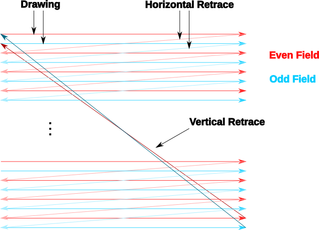

.. _dli_tutorial:

.. highlight:: ca65

Advanced Tutorial on Atari 8-bit Display List Interrupts
==========================================================

This is a tutorial on advanced Display List Interrupts (DLIs) for the Atari
8-bit series of computers. In a nutshell, DLIs provide a way to notify your
program when a particular scan line is reached, allowing you to make changes
mid-screen.

DLIs are an advanced programming technique in the sense that they require
knowledge of 6502 assembly language, so this tutorial is going to assume that
you are comfortable with that. All the examples here are assembled using the
MAC/65-compatible assembler
`ATasm<https://atari.miribilist.com/atasm/index.html>`_ (and more specifically
to this tutorial, the version built-in to Omnivore).

Here are some references for learning about display list interrupts:

 * `De Re Atari, Chapter 5 <https://www.atariarchives.org/dere/chapt05.php>`_
 * `Yaron Nir's tutorial using cc65 <https://atariage.com/forums/topic/291991-cc65-writing-a-dli-tutorial/>`_

Before diving into DLIs, it is helpful to understand that they are very
accurately named: Display List Interrupts literally interrupt the display list
-- they cause an event that is processed by your program while the ANTIC is drawing the screen. So it is necessary to understand what display lists are
before understanding what it means to interrupt one.

A Crash Course on Displays
--------------------------------

A TV screen is drawn by an electron beam tracing a path starting above the
visible area, and drawing successive horizontal lines as the beam moves down
the screen. Each line is drawn from left-to-right (as you look at the TV
screen) and when it reaches the right hand side of the screen, the horizontal
retrace starts where the beam is turned off and moved down to the next scan
line below whereupon the beam is turned back on and the next line draws. When
the full frame has been drawn, the beam is turned off again and the vertical
retrace starts (starting the vertical blank interval). Once the beam is
repositioned to the top leftmost position, the vertical blank interval ends,
the beam is turned back on, and the next frame is started.

On NTSC systems, the Atari draws 262 scan lines per frame, 60 times per second.
On PAL systems it draws 312 scan lines per frame, 50 times per second. In
either system, it draws scan lines from the top down, and left to right within
a scan line.

.. figure:: electron-beam.png
   :align: center

This simplified description is the mental model we will use to describe the
video drawing process.

How TVs really work (a better approximation)
~~~~~~~~~~~~~~~~~~~~~~~~~~~~~~~~~~~~~~~~~~~~~~~~

Real TVs are interlaced with 525 scan lines for NTSC and 625 for PAL. Every
refresh interval, the electron beam draws one *field*, starting at the top left
and drawing every other scan line. When it reaches the bottom, the vertical
retrace starts, but this time it positions the electron beam at the first
missing scan line. Then it draws the next field, again skipping every other
scan line but this time filling in the scan lines it missed.

Notice that this would mean that e.g. one NTSC frame should draw 262 scan lines
and the other 263, but apparently TVs can compensate for the missing scan line
every alternate frame, so the Atari always outputs 262 scan lines. Practically
speaking, you do not need to care that the screen is interlaced. If the screen
were unchanging, the Atari would send the same 262 scan lines regardless of
which field it is drawing.

How TVs produce the colors that they display is very complicated and so far
outside the scope of this tutorial that it might as well be magic. Suffice it
to say that color happens. On the Atari, fully-specifiable color only happens
every *color clock* and there are 228 color clocks per scan line. This
corresponds to the maximum horizontal resolution of 160 pixels (standard width
playfield) in any bitmap mode other than Antic Mode F (BASIC Graphics 8). That
is the highest horizontal resolution that support a pixel at a specifiable
color. Mode F has 320 addressable pixels, corresponding to half a color clock,
and only artifacting color is available.

.. seealso::

   * `All About Video Fields <https://lurkertech.com/lg/fields/>`_
   * `Composite artifact colors <https://en.wikipedia.org/wiki/Composite_artifact_colors>`_ article on Wikipedia

A Crash Course on Display Lists
--------------------------------

ANTIC is the special coprocessor that handles screen drawing for the Atari
computers. It is tightly coupled with the 6502 processor, and in fact can be
thought of as having control of the 6502 because the ANTIC can halt the 6502
when needed. Since only one chip can read memory at any time, ANTIC needs to
halt the 6502 when it needs access to memory, so this Direct Memory Access
(DMA) can cause 6502 instructions to appear to take more cycles than documented
in a 6502 reference. In fact, the amount of time ANTIC "steals" will depend on
many factors: the graphics mode, player/missiles being used, playfield size,
and more.

Because of the NTSC (or PAL) signal, and the fact that each frame draws 262
scan lines with 228 color clocks per scan line, the operating frequency of the
6502 was chosen such that it takes exactly 114 machine cycles per scan line,
producing 29868 machine cycles per frame. This means that in one machine cycle,
two color clocks are drawn on the screen. A typical machine instruction might
take 5 machine cycles, so 10 color clocks could pass in the time to process a
single instruction! This means we don't have much time per scan line, so it
will mean that DLIs will have to be quick.

It also means the 6502 is too slow to draw the screen itself, and this is where
ANTIC's special "machine language" comes in. You program the ANTIC coprocessor
using a display list, and ANTIC takes care of building the screen scan line by
scan line, without any more intervention from the 6502 code. (Unless you ask for intervention! And that's what a DLI is.)

The display list is the special sequence of bytes that ANTIC interprets as a
list of commands. Each command causes ANTIC to draw a certain number of scan
lines in a particular way. A DLI can be set on any ANTIC command.

An ANTIC display list command consists of 1 byte with an optional 2 byte
address. There are 3 types of commands: blank lines, graphics modes, and jump
commands. Commands are encoded into the byte using a bitmask where low 4 bits
encode the graphics mode or command and the high 4 bits encode the flags that
affect that command:

.. csv-table::

    Bit, 7, 6, 5, 4, 3-0
       , DLI, LMS, VSCROLL, HSCROLL, Mode

The 4 flags are:

* DLI ($80): enable a display list interrupt when processing this instruction
* LMS ($40): trigger a Load Memory Scan, changing where ANTIC looks for screen data, and requires an additional 2 byte address immediately following this command byte.
* VSCROLL ($20): enable vertical scrolling for this mode line
* HSCROLL ($10): enable horizontal scrolling for this mode line

The 14 available graphics modes are encoded into bits 3-0 using values as shown
in this table:

.. csv-table::

    Mode, Decimal, BASIC Mode,  Description, Scan Lines, Type, Colors
    2, 02,    0,     40 x 24,   8, text, 2
    3, 03,    n/a,   40 x 19,  10, text, 2
    4, 04,    n/a,   40 x 24,   8, text, 4
    5, 05,    n/a,   40 x 12,  16, text, 4
    6, 06,    1,     20 x 24,   8, text, 5
    7, 07,    2,     20 x 12,  16, text, 5
    8, 08,    3,     40 x 24,   8, graphic, 4
    9, 09,    4,     80 x 48,   4, graphic, 2
    A, 10,    5,     80 x 48,   4, graphic, 4
    B, 11,    6,    160 x 96,   2, graphic, 2
    C, 12,    n/a,  160 x 192,  1, graphic, 2
    D, 13,    7,    160 x 96,   2, graphic, 4
    E, 14,    n/a,  160 x 192,  1, graphic, 4
    F, 15,    8,    320 x 192,  1, graphic*, 2

*mode F is also used as the basis for the GTIA modes (Graphics 9, 10, & 11),
but this is a topic outside the scope of this tutorial.

Blank lines are encoded as a mode value of zero, the bits 6, 5, and 4 taking
the meaning of the number of blank lines rather than LMS, VSCROLL, and HSCROLL. Note that the DLI bit is still available on blank lines, however, as bit 7 is not co-opted by the blank line instruction.

Jumps are encoded using a mode value of one, and require an additional 2 byte
address for the next display list pointer. If bit 6 is also set, it becomes the
Jump and wait for Vertical Blank instruction. the DLI bit may also be set on a
jump instruction.

The typical method to change the currently active display list is to change the
address stored at SDLSTL (in low byte/high byte format in addresses $230 &
$231). At the next vertical blank, the hardware display list at DLISTL/H
($D402, $D403) will be updated with the values stored here and the screen
drawing will commence using the new display list.

The playfield portion of the display list is 192 lines in standard graphics
modes, out of the 262 possible lines in NTSC. More lines are possible, but the
maximum usable amount would depend on the TV screen being used. The more scan
lines are used, the more clock cycles are needed before hitting the vertical
blank, so making a display list with too many lines can cause timing problems
if the vertical blank also takes a long time.

More resources about display lists are available:

* https://www.atariarchives.org/mapping/memorymap.php#560,561
* https://www.atariarchives.org/mapping/appendix8.php

A Sample Display List
~~~~~~~~~~~~~~~~~~~~~~~~~~

Here is a simple display list that contains different text and graphics modes
mixed in a single screen.

A Crash Course on Display List Interrupts
---------------------------------------------

A common feature of display lists is to change colors. This first display list interrupt will change the color of the background:

.. code-block::

   dli     pha
           lda #$7a
           sta COLBK
           pla
           rti

but note that running this example causes a flickering line in the background:

WSYNC
~~~~~~~~~~

.. code-block::

   dli     pha
           lda #$7a
           sta WSYNC
           sta COLBK
           pla
           rti

In addition, there are two special commandsThe low

Changing the value of the DL shadow register SDLSTL ($230) will, at the next vertical blank, change the display list to the address specified.

In addition, some familiarity with how the ANTIC coprocessor draws the screen
will be helpful, but this is not absolutely required as this tutorial will try to cover
the necessities.

My goal is to build `MAME <http://www.mame.net/>`_ cabinets powered by a
`Raspberry Pi <http://www.raspberrypi.org/>`_ that in addition to playing
arcade games will play old retro console and home computer games.  I'm
targeting 8-bit machines so the Raspberry Pi has plenty of CPU power to
emulate things like the Atari 2600, Atari 800 and Apple II.

I'm (mostly) done with the :ref:`upright cabinet <upright>`!

Cabinets
--------

.. toctree::
   :maxdepth: 3
   
   upright
   cabaret

Design, Woodworking & Build
---------------------------

The cabinet design I liked best is Tempest.  I'm completely terrible at the
game, but the angular cabinet design stood out to me as such a classic.

.. figure:: tempest-cabaret.jpg
   :target: http://www.arcade-museum.com/game_detail.php?game_id=10065
   :align: right

.. figure:: tempest-cabinet.jpg
   :target: http://www.arcade-museum.com/game_detail.php?game_id=10065
   :align: left

The biggest design requirement is modular control panels, similar to
`Doc's Modular MAME <http://www.beersmith.com/mame/index.htm>`_ in
that I want to be able to play a lot of different types games using
different control layouts without resorting to the `frankenpanel
<http://www.brentradio.com/images/Other/MameContolPanel.jpg>`_ look.

My plan is build two MAME cabinets: a full size cabinet with a horizontal
monitor and a cabaret with a vertical monitor.  For a cabaret, the Atari
cabarets all seem to be the same, so while it doesn't really matter which
game's cab I use, I grabbed the Tempest one for consistency.  I found Google
Sketchup designs for both and modified them to fit my ideas.

The modular panels can be shared between both cabs, so the control panel
dimensions have the same depth.  The difference is the width: the full-size
cab has a 24" wide panel, while the cabaret has an 18" wide panel.  The full-
size cab is wide enough to be used for simultaneous two-player games, while
the 18" wide panel of the cabaret is limits its use to one player at a time.

.. toctree::
   :maxdepth: 3
   
   control-panel
   wiring
   upright-woodworking
   cabaret-woodworking
   sideart

Computer
--------

.. toctree::
   :maxdepth: 3
   
   rpi
   summary-037b5
   summary-106

Links
-----

* `Doc's Modular MAME <http://www.beersmith.com/mame/index.htm>`_
* `Rick Reynolds' modular panel cabinet <http://www.rickandviv.net/index.php/the-frinkiac-7/>`_
* `Brian Sturk's metal modular panels <https://dl.dropboxusercontent.com/u/15568023/site/mame.html>`_
* http://spystyle.arcadecontrols.com/Massive-Mame_How-to_mirror/
* http://www.hanselman.com/blog/BuildingYourOwnArcadeCabinetForGeeksPart1TheCabinet.aspx
* `Nice writeup of a RPi-powered mini coctail cab <http://circuitbeard.co.uk/blog/rombus-ct-a-raspberry-pi-powered-mini-cocktail-arcade>`_
