.. _dli_tutorial:

.. highlight:: ca65

.. |copy|   unicode:: U+000A9 .. COPYRIGHT SIGN

Atari 8-bit Display List Interrupts: A Complete(ish) Tutorial
======================================================================

**Revision 7, updated 26 Dec 2019**

This is a tutorial on Display List Interrupts (DLIs) for the Atari 8-bit series
of computers. In a nutshell, DLIs provide a way to notify your program when a
particular scan line is reached, allowing you to make changes mid-screen.

No prior knowledge of DLIs is necessary before reading this tutorial. However,
DLIs are an advanced programming technique in the sense that they require
knowledge of 6502 assembly language, so this tutorial is going to assume that
you are comfortable with that.

All the examples here are assembled using the MAC/65-compatible assembler
`ATasm <https://atari.miribilist.com/atasm/index.html>`_ (and more specifically
to this tutorial, the version built-in to `Omnivore <https://github.com/robmcmullen/omnivore>`_).

.. note:: All source code and XEX files are available in the `dli_tutorial source code repository <https://github.com/playermissile/dli_tutorial>`_ on github.

.. note:: This tutorial is Copyright |copy| 2019 and licensed under the `CC BY-SA 4.0 <https://creativecommons.org/licenses/by-sa/4.0/>`_, except for the *assembly language source code* (both in this tutorial and in the repository), which is placed in the public domain via `CC0 <https://creativecommons.org/publicdomain/zero/1.0/>`_.

Before diving into DLIs, it is helpful to understand that they are very
accurately named: Display List Interrupts literally interrupt the display list
-- they cause an event that is processed by your program as the computer is in
the middle of drawing the screen. So it is necessary to understand what display
lists are before understanding what it means to interrupt one, and even before that we must understand how the Atari uses the display list to generate the images shown on the screen.

.. seealso::

   Here are some resources for learning more about display list interrupts:

   * `De Re Atari, Chapter 5 <https://www.atariarchives.org/dere/chapt05.php>`_
   * `Yaron Nir's tutorial using cc65 <https://atariage.com/forums/topic/291991-cc65-writing-a-dli-tutorial/>`_

Displays: A Tiny Overview of How TVs Work
--------------------------------------------------------

A TV screen is drawn by an electron beam tracing a path starting above the
visible area, and drawing successive horizontal lines as the beam moves down
the screen. Each line is drawn from left-to-right (as you look at the TV
screen) and when it reaches the right hand side of the screen, the horizontal
retrace starts where the beam is turned off and moved down to the next scan
line below whereupon the beam is turned back on and the next line draws. When
the full frame has been drawn, the beam is turned off again and the vertical
retrace starts (starting the vertical blank interval). Once the beam is
repositioned to the top leftmost position, the vertical blank interval ends,
the beam is turned back on, and the next frame is started.

On NTSC systems, the Atari draws 262 scan lines per frame, 60 times per second.
On PAL systems it draws 312 scan lines per frame, 50 times per second. In
either system, it draws scan lines from the top down, and left to right within
a scan line.

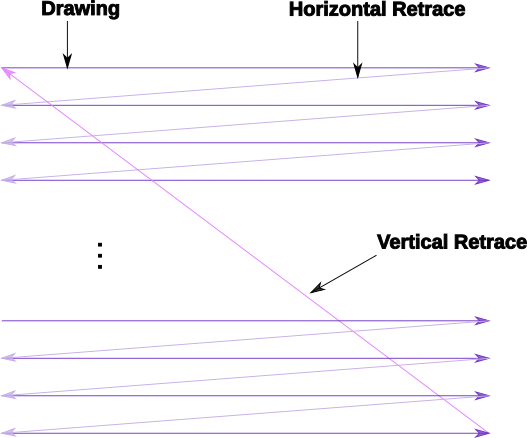

This simplified description is the mental model we will use to describe the
video drawing process. Real TVs are much more complicated, but for the
purposes of this tutorial are not important. The Atari was constrained to
produce images that rendered on the displays of the time, but the details of
how each type of display works (e.g. interlaced TV vs progressive scan
monitor) doesn't affect the signal output by the Atari.

One detail of color production is worth mentioning: a unit called the
color clock, which is the smallest portion of a scan line that can be
displayed with an arbitrary color. There are 228 color clocks per scan line,
of which about 160 were typically visible on a cathode-ray TV display in the
1970s when the Atari was developed. This corresponds to the 160 pixel
horizontal resolution of Antic Modes B through E in the standard width
playfield. Antic Mode F (Graphics 8 in BASIC) has 320 addressable pixels,
corresponding to half a color clock, and only artifacting color is available.

Color clocks also form the basis for the operating speed of the entire
machine. For NTSC, the speed was chosen based on the use of a commonly
available hardware component in use for TV displays, called an NTSC
oscillating crystal. This component generates a pulse with a frequency of
14.31818 MHz. This frequency was then divided by eight to produce the
1.7897725 MHz clock at which the 6502 runs. By defining one CPU cycle to
correspond to two color clocks, means there are 114 machine cycles per scan
line. 262 scan lines per frame results in 29868 machine cycles every frame.
And running at 1.7897725 Mhz means there are 1789772.5 machine cycles
happening every second, which produces a frame rate of 59.92 Hz which can be
displayed on a TV (even if it does not exactly sync up with broadcast NTSC).

PAL systems produce the same 228 color clocks and 114 machine cycles per line,
but display 312 scan lines. This results in 35568 cycles per frame. The PAL
crystal oscillates with a frequency of 14.18757 MHz, divided by 8 to produce a
CPU frequency of 1.77344625 Mhz, and 35568 cycles per frame produces a frame
rate of 49.86 Hz; again, not syncing exactly with broadcast PAL but within
tolerances to be displayed.

.. seealso::

   * `All About Video Fields <https://lurkertech.com/lg/fields/>`_
   * `NTSC Demystified <https://sagargv.blogspot.com/2011/04/ntsc-demystified-part-1-b-video-and.html>`_, (*haha*), a very long series of blog posts describing NTSC encoding
   * Obligatory link to the `NTSC article on Wikipedia <https://en.wikipedia.org/wiki/NTSC>`_
   * `Composite artifact colors <https://en.wikipedia.org/wiki/Composite_artifact_colors>`_ article on Wikipedia
   * Section 4.2 in the `Altirra Hardware Reference Manual (PDF) <http://www.virtualdub.org/downloads/Altirra%20Hardware%20Reference%20Manual.pdf>`_ for much more technical detail and far, far less hand-waving.
   * Discussion on NTSC pixel clocks and timing at `retrocomputing.stackexchange.com <https://retrocomputing.stackexchange.com/a/2206/6847>`_

.. _display_lists:

Display Lists: How the Atari Generates the Display
---------------------------------------------------------------

ANTIC is the special coprocessor that handles screen drawing for the Atari
computers. It is tightly coupled with the 6502 processor, and in fact can be
thought of as being the driver of the 6502 because the ANTIC can halt the 6502
when needed. Since only one chip can read memory at any time, ANTIC needs to
halt the 6502 when it needs access to memory, so this Direct Memory Access
(DMA) can cause 6502 instructions to appear to take more cycles than documented
in a 6502 reference. In fact, the amount of time ANTIC "steals" will depend on
many factors: the graphics mode, player/missiles being used, playfield size,
and more.

Since there are 228 color clocks and 114 machine cycles per scan line, this
means that in one machine cycle, two color clocks are drawn on the screen. A
typical machine instruction might take 5 machine cycles, so 10 color clocks
could pass in the time to process a single instruction! This means we don't
have much time per scan line, so DLIs that attempt to change graphics in the
middle of a line will have to be well optimized.

It also means the 6502 is too slow to draw the screen itself, and this is
where ANTIC's special "instruction set" comes in. You program the ANTIC
coprocessor using a display list, and ANTIC takes care of building the screen
scan line by scan line, without any more intervention from the 6502 code.
(Unless you ask for intervention! And that's what a DLI is.)

The display list is the special sequence of bytes that ANTIC interprets as a
list of instruction. Each instruction causes ANTIC to draw a certain number of
scan lines in a particular way. A DLI can be set on any ANTIC instruction.

ANTIC supports display lists that produce at most 240 scan lines (even on PAL
systems where many more scan lines are available), and the vertical blank
interval always starts after 248 scan lines. When drawing scan lines, ANTIC
skips 8 scan lines at to top of the display, so the output from the display
list starts at the 9th scan line. A standard display list starts with 24 blank
lines and 192 scan lines of display data, meaning that the TV will see 32 blank
lines (the 8 automatically skipped plus the 24 in a standard display list)
followed by 192 scan lines of display, then 24 blank lines, and finally the
vertical blank that consumes the remaining 14 scan lines on NTSC (or 64 on
PAL).

Display List Instruction Set
~~~~~~~~~~~~~~~~~~~~~~~~~~~~~~~~

An ANTIC display list instruction consists of 1 byte with an optional 2 byte
address. There are 3 types of instructions: blank lines, graphics modes, and
jump instructions. Instructions are encoded into the byte using a bitmask
where low 4 bits encode the graphics mode or feature and the high 4 bits
encode the flags that affect that instruction:

  +-----+-----+---------+---------+-----+-----+-----+-----+
  |  7  |  6  |  5      |    4    |  3  |  2  |  1  |  0  |
  +-----+-----+---------+---------+-----+-----+-----+-----+
  | DLI | LMS | VSCROLL | HSCROLL |  Mode                 |
  +-----+-----+---------+---------+-----+-----+-----+-----+

The 4 flags are:

 * DLI (``$80``): enable a display list interrupt when processing this instruction
 * LMS (``$40``): trigger a Load Memory Scan, changing where ANTIC looks for screen data, and requires an additional 2 byte address immediately following this instruction byte.
 * VSCROLL (``$20``): enable vertical scrolling for this mode line
 * HSCROLL (``$10``): enable horizontal scrolling for this mode line

The 14 available graphics modes are encoded into low 4 bits using values as shown
in this table:

.. csv-table::

    Mode, Decimal, BASIC Mode,  Description, Scan Lines, Type, Colors
    2, 02,    0,     40 x 24,   8, text, 2
    3, 03,    n/a,   40 x 19,  10, text, 2
    4, 04,    n/a,   40 x 24,   8, text, 4
    5, 05,    n/a,   40 x 12,  16, text, 4
    6, 06,    1,     20 x 24,   8, text, 5
    7, 07,    2,     20 x 12,  16, text, 5
    8, 08,    3,     40 x 24,   8, bitmap, 4
    9, 09,    4,     80 x 48,   4, bitmap, 2
    A, 10,    5,     80 x 48,   4, bitmap, 4
    B, 11,    6,    160 x 96,   2, bitmap, 2
    C, 12,    n/a,  160 x 192,  1, bitmap, 2
    D, 13,    7,    160 x 96,   2, bitmap, 4
    E, 14,    n/a,  160 x 192,  1, bitmap, 4
    F, 15,    8,    320 x 192,  1, bitmap*, 2

*mode F is also used as the basis for the GTIA modes (BASIC Graphics modes 9,
10, & 11), but this is a topic outside the scope of this tutorial.

Blank lines are encoded as a mode value of zero, the bits 6, 5, and 4 taking
the meaning of the number of blank lines rather than LMS, VSCROLL, and
HSCROLL. Note that the DLI bit is still available on blank lines, as bit 7 is
not co-opted by the blank line instruction.

.. csv-table:: Blank Line Instructions

    Hex, Decimal, Blank Lines
    0, 0, 1
    10, 16, 2
    20, 32, 3
    30, 48, 4
    40, 64, 5
    50, 80, 6
    60, 96, 7
    70, 112, 8

Jumps provide the capability to split a display list into multiple parts in
different memory locations. They are encoded using a mode value of one, and
require an additional 2 byte address where ANTIC will look for the next display
list instruction. If bit 6 is also set, it becomes the Jump and wait for Vertical
Blank (JVB) instruction, which is how ANTIC knows that the display list is
finished. The DLI bit may also be set on a jump instruction, but if set on the
JVB instruction it triggers a DLI on every scan line from there until the
vertical blank starts on the 249th scan line.

.. note::

   Apart from the ``$41`` JVB instruction, splitting display lists using other
   jumps like the ``$01`` instruction is not common. It has a side-effect of
   producing a single blank line in the display list.

The typical method to change the currently active display list is to change the
address stored at ``SDLSTL`` (in low byte/high byte format in addresses
``$230`` and ``$231``). At the next vertical blank, the hardware display list
at ``DLISTL`` (``$d402`` and ``$d403``) will be updated with the values stored
here and the screen drawing will commence using the new display list.

.. seealso::

   More resources about display lists are available:

   * https://www.atariarchives.org/mapping/memorymap.php#560,561
   * https://www.atariarchives.org/mapping/appendix8.php

A Sample Display List
~~~~~~~~~~~~~~~~~~~~~~~~~~

Here is a display list that contains different text modes mixed in a single screen.

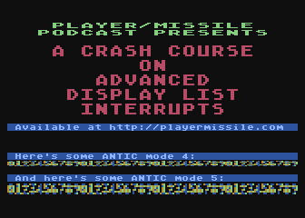

.. raw:: html

   <ul>
   <li><b>Source Code:</b> <a href="https://raw.githubusercontent.com/playermissile/dli_tutorial/master/src/sample_display_list.s">sample_display_list.s</a></li>
   <li><b>Executable:</b> <a href="https://raw.githubusercontent.com/playermissile/dli_tutorial/master/xex/sample_display_list.xex">sample_display_list.xex</a></li>
   </ul>

.. code-block::

   dlist   .byte $70,$70,$70  ; 24 blank lines
           .byte $46,$00,$40  ; Mode 6 + LMS, setting screen memory to $4000
           .byte 6            ; Mode 6
           .byte $70          ; 8 blank lines
           .byte 7,7,7,7,7    ; 5 lines of Mode 7
           .byte $70          ; 8 blank lines
           .byte 2            ; single line of Mode 2
           .byte $70,$70,$70  ; 24 blank lines
           .byte 2,4          ; Mode 2 followed by mode 4
           .byte $70          ; 8 blank lines
           .byte 2,5          ; Mode 2 followed by mode 5
           .byte $41,<dlist,>dlist ; JVB, restart same display list on next frame

Cycle Stealing by ANTIC
~~~~~~~~~~~~~~~~~~~~~~~~~~~~~~~~~

The ANTIC coprocessor needs to access memory to perform its functions, and
since the 6502 and ANTIC can't both access at once, ANTIC will pause execution
of the 6502 when it needs to read memory. It happens at specific points within
the 114 cycles of each scan line, but where it happens (and how many times the
6502 gets paused during the scan line) depends on the graphics mode.

For overhead, ANTIC will typically steal 3 cycles to read the display list, 5
cycles if player/missile graphics are enabled, and 9 cycles for memory
refreshing. Scrolling requires additional cycle stealing because ANTIC needs
to fetch more memory.

Bitmapped modes (modes 8 - F) have cycles stolen corresponding to the number
of bytes per line used in that mode. For example, mode E will use an
additional 40 cycles, so in the context of writing a DLI for a game, the
typical number of stolen cycles could be 57 out of the 114 cycles per scan
line: 17 cycles for ANTIC overhead and 40 for the number of bytes per line.

Text modes require additional cycles over bitmapped graphics modes, because
ANTIC must fetch the font glyphs in addition to its other work. The first scan
line of a font mode is almost entirely used by ANTIC and only a small number
of cycles is available to the 6502. For normal 40-byte wide playfields, the
first line of ANTIC modes 2 through 5 will yield at most about 30 cycles and
subsequent lines about 60 cycles per scan line.

About the worst-case scenario is one of the best modes for games: ANTIC mode
4. This text mode, combined with scrolling and player/missile graphics and can
reduce the available cycles to fewer than 10 on the first line and about 50 on
subsequent lines!

.. seealso::

   Section 4.14 in the
   `Altirra Hardware Reference Manual (PDF)<http://www.virtualdub.org/downloads/Altirra%20Hardware%20Reference%20Manual.pdf>`_
   contains tables depicting exactly which cycles are stolen by ANTIC for
   each mode.

Restrictions
~~~~~~~~~~~~~~~~~~~~

 * display lists cannot cross a 1K boundary
 * display list data cannot cross a 4k boundary, so you must use a display list command with the ``LMS`` bit if using a bitmapped display mode that will result in a larger memory usage

.. _dli_crash_course:

Display List Interrupts: A Crash Course
---------------------------------------------

DLIs are non-maskable interrupts (NMIs), meaning they cannot be ignored. When
an NMI occurs, the 6502 jumps to the address stored at ``$fffa``, which points
to an OS routine that checks the type of interrupt (either a DLI or a VBI) and
vectors through the appropriate user vector. The NMI handler takes care of
saving the processor status register and sets the interrupt flag, but *does
not* save any processor registers. The user routine is responsible for saving
any registers that it uses, restoring them when it is done using them, and must
exit using the ``RTI`` instruction.

Display list interrupts are not enabled by default. To use a DLI, the address
vector at ``VDSLST`` (``$200`` and ``$201``) must be set to your routine, and
then they must be enabled through a write to ``NMIEN`` at ``$d40e``.

.. warning::

   You must set the address of your DLI before enabling them, otherwise the DLI
   could be called and use whatever address is stored at ``$200``.

This initialization code can look like the following, where the constants
``NMIEN_VBI`` and ``NMIEN_DLI`` are defined as ``$40`` and ``$80``,
respectively, in `hardware.s` in the sample repository. Since ``NMIEN`` also
controls the vertical blank interrupt, you must make sure that the VBI enable
flag is also set.

.. code-block::

           ; load display list interrupt address
           lda #<dli
           sta VDSLST
           lda #>dli
           sta VDSLST+1

           ; activate display list interrupt and vertical blank interrupt
           lda #NMIEN_DLI | NMIEN_VBI
           sta NMIEN

If your program has multiple DLIs, it may be necessary to set your DLIs in a
vertical blank interrupt to guarantee that ANTIC will process them in the
right order. Outside the VBI, your code could be running at an arbitrary scan
line, perhaps between display list instructions that have their DLI bits set.
In Yaron Nir's tutorial a different technique is used, one not requiring a
vertical blank interrupt but instead using the ``RTCLOK`` 3-byte zero page
variable to instead infer that a VBI has *just* occurred. The last of the
bytes, location ``$14``, is incremented every vertical blank, so that
technique is to wait until location ``$14`` changes, then set ``NMIEN``:

.. code-block::

           lda RTCLOK+2
   ?loop   cmp RTCLOK+2  ; will be equal until incremented in VB
           beq ?loop

           ; activate display list interrupt and vertical blank interrupt
           lda #NMIEN_DLI | NMIEN_VBI
           sta NMIEN

Hardware & Shadow Registers
~~~~~~~~~~~~~~~~~~~~~~~~~~~~~~~~~~~~~~~~~~~~~~~~~~~~~

The Atari is a memory-mapped system, where hardware devices like the ANTIC and
GTIA chips are *mapped* to locations in memory and data is passed back and
forth by reading or writing to specific addresses. They are usually either
read-only or write-only, and many times an address is used for wildly
different features depending on whether the address is read from or written
to.

Some of these hardware locations also have *shadow* registers in low RAM
(typically page 2) that are labeled as performing the same function as a
hardware register, with two important differences.

First, they can be both read and written to, so (assuming you always use the
shadow register to update the hardware register) it is possible to find out
the current state of a hardware register by reading its shadow.

Second, the hardware register is only updated **once every vertical blank** by
an operating system routine that copies the shadow value to its hardware
counterpart. Note that it does not happen the other way around, so changing a
hardware register *does not* update a shadow register.

The shadow registers are a convenience for development in higher level
languages like BASIC where speed is not paramount. But code within a DLI must
use hardware registers directly to affect change on a scan line.

The shadow registers can still be useful in DLI development, in that they will
automatically reset the hardware registers to the values in the shadow
registers every vertical blank. This can be used to reset features like
graphics colors and the character set address for the top of the screen at the
next frame.

.. note:: This only works if the operating system's immediate vertical blank routine has not been replaced (i.e. you are only using the deferred vertical blank ``VVBLKD`` at ``$224`` and haven't replaced the immediate vertical blank rountine ``VVBLKI`` at ``$222``).

Some hardware registers have no shadows, like player position and size, so
your own code (in the deferred VBI or the final DLI) must reset these to their
correct values for the top of the screen.

.. csv-table:: Some Useful Shadow Registers
   :widths: 10,10,10,10,60

    Shadow, Hex, Hardware, Hex, Description
    GPRIOR, 26f, PRIOR, d01b, Player/playfield priority selection register
    PCOLR0, 2c0, COLPM0, d012, Color of player/missile 0
    PCOLR1, 2c1, COLPM1, d013, Color of player/missile 1
    PCOLR2, 2c2, COLPM2, d014, Color of player/missile 2
    PCOLR3, 2c3, COLPM3, d015, Color of player/missile 3
    COLOR0, 2c4, COLPF0, d016, Color of playfield 0
    COLOR1, 2c5, COLPF1, d017, Color of playfield 1
    COLOR2, 2c6, COLPF2, d018, Color of playfield 2
    COLOR3, 2c7, COLPF3, d019, Color of playfield 3
    COLOR4, 2c8, COLBK, d01a, Background color
    CHACT, 2f3, CHACTL, d401, "Character mode (inverse, upside-down characters)"
    CHBAS, 2f4, CHBASE, d409, Character base (page number of font)

Basic Display List Interrupts
--------------------------------------

Our First Display List
~~~~~~~~~~~~~~~~~~~~~~~~~~

A common use of display lists is to change colors in the middle of the
screen.

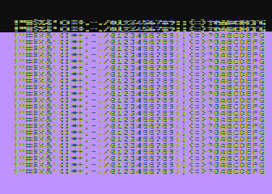

.. raw:: html

   <ul>
   <li><b>Source Code:</b> <a href="https://raw.githubusercontent.com/playermissile/dli_tutorial/master/src/first_dli.s">first_dli.s</a></li>
   <li><b>Executable:</b> <a href="https://raw.githubusercontent.com/playermissile/dli_tutorial/master/xex/first_dli.xex">first_dli.xex</a></li>
   </ul>

Here is our first display list interrupt:

.. code-block::

   dli     pha             ; only using A register, so save old value to the stack
           lda #$7a        ; new background color
           sta COLBK       ; store it in the hardware register
           pla             ; restore the A register
           rti             ; always end DLI with RTI!

This is all the code it takes to change the color of the background. The
obvious effect is the flickering line in the background, which we will solve
in the next section.

Examining the code shows the boilerplate discussed :ref:`above <dli_crash_course>` where DLIs always end with the ``RTI`` instruction
and any registers used must be saved before your code changes them, and
restored upon exit.

The work performed in the interrupt is just two instructions: a load of a
color value and a store where it puts it in the *hardware* register for the
background color. Again, as noted `above <Hardware & Shadow Registers_>`_,
hardware registers must be used in DLIs, not the shadow registers as shadow
registers are ignored until the vertical blank.

WSYNC: How to Avoid Flickering
~~~~~~~~~~~~~~~~~~~~~~~~~~~~~~~~~~~~~~~~~~~~~

The Atari provides a way to sync with a scan line to avoid the flickering effect
of the previous example.

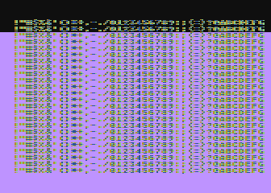

.. raw:: html

   <ul>
   <li><b>Source Code:</b> <a href="https://raw.githubusercontent.com/playermissile/dli_tutorial/master/src/first_dli_with_wsync.s">first_dli_with_wsync.s</a></li>
   <li><b>Executable:</b> <a href="https://raw.githubusercontent.com/playermissile/dli_tutorial/master/xex/first_dli_with_wsync.xex">first_dli_with_wsync.xex</a></li>
   </ul>

The flickering is avoided by saving some value (any value, the bit pattern is
not important) to the ``WSYNC`` memory location at ``$d40a``. This causes the
6502 to stop processing instructions until the electron beam nears the end of
the scan line, at which point the 6502 will resume executing instructions.
Because the electron beam is usually off-screen at this point, it is safe to
change color registers for at least the next several instructions without
artifacts appearing on screen.

.. code-block::

   dli     pha             ; only using A register, so save old value to the stack
           lda #$7a        ; new background color
           sta WSYNC       ; any value saved to WSYNC will trigger the pause
           sta COLBK       ; store it in the hardware register
           pla             ; restore the A register
           rti             ; always end DLI with RTI!

.. note::

   ``WSYNC`` (wait for horizontal blank) usually restarts the 6502 on or
   about cycle 105 out of 114, but there are cases that can delay that. See the
   Altirra Hardware Reference Manual for more information.

.. _rainbow_wsync:

A DLI Can Affect Many Scan Lines
~~~~~~~~~~~~~~~~~~~~~~~~~~~~~~~~~~~~~~~~~~~~

This example shows that a single DLI affect multiple scan lines, even crossing
into subsequent ANTIC mode 4 lines in the display list.

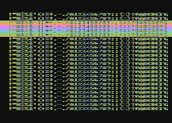

.. raw:: html

   <ul>
   <li><b>Source Code:</b> <a href="https://raw.githubusercontent.com/playermissile/dli_tutorial/master/src/rainbow_wsync.s">rainbow_wsync.s</a></li>
   <li><b>Executable:</b> <a href="https://raw.githubusercontent.com/playermissile/dli_tutorial/master/xex/rainbow_wsync.xex">rainbow_wsync.xex</a></li>
   </ul>

DLIs can really be thought of as a way for your program to be told when a
certain display list instruction is reached. Apart from the setup and teardown of
the DLI subroutine itself and some timing limitations discussed in the next
section, arbitrary amounts of code can be executed in a DLI.

.. note::

   Author's note: thinking that DLIs had to be short was a great source of
   confusion to me when trying to figure out how rainbow effects were
   generated. My thinking was that DLIs could only affect a single line, and
   for instance I could not figure out how to get a color change in the middle
   of a text mode. I don't know why I thought that something bad would happen
   if a DLI went long, but I did.

This DLI changes background colors 16 times, where each color change lasts 2
scan lines. So 32 scan lines means that it covers 4 display list entries of
ANTIC mode 4.

.. code-block::

   dli     pha             ; save A & X registers to stack
           txa
           pha
           ldx #16         ; make 16 color changes
           lda #$a         ; initial color
           sta WSYNC       ; first WSYNC gets us to start of scan line we want
   ?loop   sta COLBK       ; change background color
           clc
           adc #$10        ; change color value, luminance remains the same
           dex             ; update iteration count
           sta WSYNC       ; make it the color change last ...
           sta WSYNC       ;   for two scan lines
           bne ?loop       ; sta doesn't affect flags so this still checks result of dex
           lda #$00        ; reset background color to black
           sta COLBK
           pla             ; restore X & A registers from stack
           tax
           pla
           rti             ; always end DLI with RTI!

Display List Interrupts Getting Interrupted
-----------------------------------------------------------------

Because DLIs are non-maskable interrupts and NMIs can't be blocked, a DLI will
interrupt whatever is happening, including another DLI. To summarize:

 * DLIs can be interrupted by other DLIs
 * DLIs can be interrupted by the vertical blank
 * The vertical blank can be interrupted by a DLI
 * a DLI on a JVB instruction will cause interrupts on every scan line until the vertical blank

DLI Interrupting Another DLI
~~~~~~~~~~~~~~~~~~~~~~~~~~~~~~~~~

Here's a similar DLI to the above, except it changes the luminance value
instead of the color value to make the effect easier to see. It starts with a
bright pink and gets dimmer down to a dark red after 32 scan lines. But this
time, the display list has *two* mode 4 lines that have the DLI bit set, the
2nd and 4th:

.. code-block::

   dlist   .byte $70,$70,$70
           .byte $44,$00,$40
           .byte $84  ; first DLI triggered on last scan line
           .byte 4
           .byte $84  ; second DLI triggered on last scan line
           .byte 4,4,4,4,4,4,4,4
           .byte 4,4,4,4,4,4,4,4
           .byte 4,4,4,4
           .byte $41,<dlist,>dlist

The first DLI takes 32 scan lines to complete, but it is only 16 scan lines
through its operation when the second DLI hits:

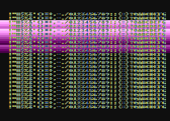

.. raw:: html

   <ul>
   <li><b>Source Code:</b> <a href="https://raw.githubusercontent.com/playermissile/dli_tutorial/master/src/dli_interrupting_dli.s">dli_interrupting_dli.s</a></li>
   <li><b>Executable:</b> <a href="https://raw.githubusercontent.com/playermissile/dli_tutorial/master/xex/dli_interrupting_dli.xex">dli_interrupting_dli.xex</a></li>
   </ul>

When a DLI is interrupted, its state is saved just as if a normal program was
interrupted. The interrupting code is then executed, and upon its completion,
the control returns to the DLI at the point where it left off. But at this
point, due to the interrupting event, the restored DLI will be resumed some
number of scan lines below where it was interrupted, likely resulting in
unplanned behavior.

.. code-block::

   dli     pha             ; save A & X registers to stack
           txa
           pha
           ldx #16         ; make 16 color changes
           lda #$5f        ; initial bright pink color
           sta WSYNC       ; first WSYNC gets us to start of scan line we want
   ?loop   sta COLBK       ; change background color
           sec
           sbc #1          ; make dimmer by decrementing luminance value
           dex             ; update iteration count
           sta WSYNC       ; make it the color change last ...
           sta WSYNC       ;   for two scan lines
           bne ?loop       ; sta doesn't affect processor flags so we are still    checking result of dex
           lda #$00        ; reset background color to black
           sta COLBK
           pla             ; restore X & A registers from stack
           tax
           pla
           rti             ; always end DLI with RTI!

Because the display list vector ``VDLSTL`` is not changed, the same code will
be called each time an interrupt occurs.

The first DLI hits and starts with a bright background color on the first scan
line of the third line of text. But because this display list takes a long
time, the second DLI on the 4th text line gets triggered before the first DLI
has hit its ``RTI`` instruction. ANTIC interrupts the first DLI and starts the
2nd DLI anyway. This effect is visible in the 5th line of text: the background
color is bright again.

But notice another artifact: the effect on the 5th line of text isn't on its
first scan line, but its second:

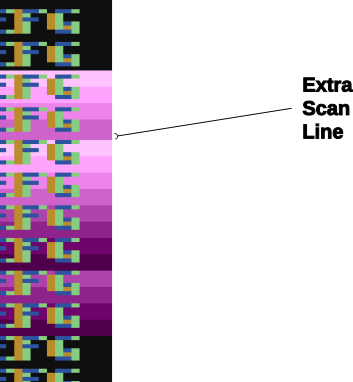

This is due to the fact that a WSYNC was called on the previous scan line, but
the interrupt happened as well. The interrupt takes some cycles to begin, and
by the time that happened **and** ANTIC stole all of its cycles to set up the
text mode line, there weren't enough cycles left for the first ``WSYNC`` in the
DLI code to happen on the same scan line. This forces that ``WSYNC`` to happen
on the next line, causing the delay and the appearance of a 3rd scan line of the
same color before the second DLI starts its color cycling.

The second DLI completes and performs its ``RTI``, but then it returns control
to the first DLI, which is already halfway done with its color cycling. When it
resumes control, it is in 9th line of text on the screen, so it has four more
color changes before it hits its own ``RTI``.

Emulator Differences
~~~~~~~~~~~~~~~~~~~~~~~~~~~

The DLI interrupting another DLI is clearly an edge case, and edge cases are
always good stress tests for emulators. A difference is clearly visible below
when comparing a zoomed in portion of the display generated by the Altirra
emulator as compared to the atari800 emulator (standalone or as embedded in
Omnivore, they are the same code and produce the same result):

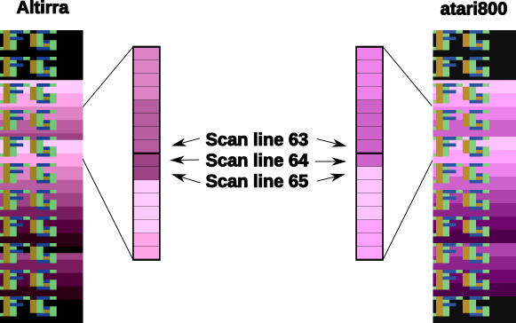

Notice how Altirra gets the color from the first DLI for two scan lines, 64
and 65, before the correct color appears on scan line 66. The output from
Altirra shows that the NMI doesn't happen until between scan line 63 and 64.
But clearly, the ``sta COLBK`` at scan line 63 is taking effect on scan line
64, because scan line 64 has the background color ``$57``. It appears the
store of ``$5f`` on scan line 65, started on cycle 1 of that line, isn't
actually executed until much, much later since the ``sec`` doesn't begin until
cycle 108. This puts that color change in the horizontal blank period of scan
line 65, which would seem to explain why Altirra shows two scan lines with the
background color from the first DLI.

This is the CPU history from the Altirra emulator:

.. code-block:: none

      60:  3 | A=58 X=09 Y=00 (   I C) | 3030: 8D 0A D4          STA WSYNC
      60:  7 | A=58 X=09 Y=00 (   I C) | 3033: 8D 0A D4          STA WSYNC
      60:108 | A=58 X=09 Y=00 (   I C) | 3036: D0 F1             BNE $3029
      61:107 | A=58 X=09 Y=00 (   I C) | 3029: 8D 1A D0  L3029   STA COLBK
      61:111 | A=58 X=09 Y=00 (   I C) | 302C: 38                SEC
      61:113 | A=58 X=09 Y=00 (   I C) | 302D: E9 01             SBC #$01
      62:  1 | A=57 X=09 Y=00 (   I C) | 302F: CA                DEX
      62:  3 | A=57 X=08 Y=00 (   I C) | 3030: 8D 0A D4          STA WSYNC
      62:  7 | A=57 X=08 Y=00 (   I C) | 3033: 8D 0A D4          STA WSYNC
      62:108 | A=57 X=08 Y=00 (   I C) | 3036: D0 F1             BNE $3029
      63:107 | A=57 X=08 Y=00 (   I C) | 3029: 8D 1A D0  L3029   STA COLBK
   - NMI interrupt (DLI)
      64:  5 | A=57 X=08 Y=00 (   I C) | E791: 2C 0F D4  LE791   BIT NMIST
      64: 11 | A=57 X=08 Y=00 (N  I C) | E794: 10 03             BPL $E799
      64: 13 | A=57 X=08 Y=00 (N  I C) | E796: 6C 00 02          JMP (VDSLST)
      64: 19 | A=57 X=08 Y=00 (N  I C) | 301F: 48                PHA
      64:102 | A=57 X=08 Y=00 (N  I C) | 3020: 8A                TXA
      64:104 | A=08 X=08 Y=00 (   I C) | 3021: 48                PHA
      64:107 | A=08 X=08 Y=00 (   I C) | 3022: A2 10             LDX #$10
      64:109 | A=08 X=10 Y=00 (   I C) | 3024: A9 5F             LDA #$5F
      64:111 | A=5F X=10 Y=00 (   I C) | 3026: 8D 0A D4          STA WSYNC
      65:  1 | A=5F X=10 Y=00 (   I C) | 3029: 8D 1A D0  L3029   STA COLBK
      65:108 | A=5F X=10 Y=00 (   I C) | 302C: 38                SEC
      65:110 | A=5F X=10 Y=00 (   I C) | 302D: E9 01             SBC #$01
      65:112 | A=5E X=10 Y=00 (   I C) | 302F: CA                DEX
      66:  0 | A=5E X=0F Y=00 (   I C) | 3030: 8D 0A D4          STA WSYNC
      66:  4 | A=5E X=0F Y=00 (   I C) | 3033: 8D 0A D4          STA WSYNC
      66:108 | A=5E X=0F Y=00 (   I C) | 3036: D0 F1             BNE $3029
      67:107 | A=5E X=0F Y=00 (   I C) | 3029: 8D 1A D0  L3029   STA COLBK

The atari800 emulator hits the DLI two instructions earlier than Altirra,
immediately after the two ``sta WSYNC`` commands (and therefore before the
``sta COLBK`` that causes Altirra to have a new color on scan line 64). In the
atari800/Omnivore instruction history below:

.. code-block:: none

   <instruction history from omnivore goes here>

the DLI starts late on scan line 63 as (naively) expected and gets to the
``sta WSYNC`` early in scan line 64 while there is still time to hit the ``sta
COLBK`` while still on scan line 64. This changes scan line 65 to be the
correct background color for the second DLI.

.. note:: I'm not sure what's going on with the differences in the WSYNC behavior between the two emulators. On Altirra, the two WSYNC commands seem to occur on scan line 62, but their effects aren't felt immediately, so perhaps this is what's causing the DLI to hit on scan line 64 instead of scan line 63. On atari800, the WSYNC commands cause their effects to be felt immediately, in the next command. I would presume that Altirra is closer to what's going on with real hardware, as the author of Altirra has written the definitive guide to the internals of the machine, and Altirra has always been the leader in cycle-exact emulation.

I think the takeaway from this section is: don't let your DLI get interrupted
by anything else, or it is likely that you will encounter emulation
differences.

VBI Interrupting A DLI
~~~~~~~~~~~~~~~~~~~~~~~~~~~~~~~~~

Here is an example of the vertical blank interrupting a DLI.

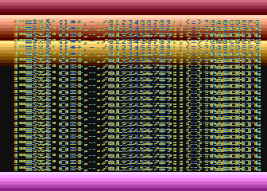

.. raw:: html

   <ul>
   <li><b>Source Code:</b> <a href="https://raw.githubusercontent.com/playermissile/dli_tutorial/master/src/vbi_interrupting_dli.s">vbi_interrupting_dli.s</a></li>
   <li><b>Executable:</b> <a href="https://raw.githubusercontent.com/playermissile/dli_tutorial/master/xex/vbi_interrupting_dli.xex">vbi_interrupting_dli.xex</a></li>
   </ul>

The DLI is started at the bottom of the screen, gets interrupted by the VBI,
and picks up again when VBI ends. Even though the electron beam is turned off,
``WSYNC`` is still called and performs its delay function when the scan line
is off screen. The resulting image resumes its color cycling background on the
top of the screen, stopping after 128 scan lines even though only a fraction
of those are actually visible on screen.

DLI Interrupting A VLI
~~~~~~~~~~~~~~~~~~~~~~~~~~~~~~~~~

And for completeness, here is an example of a DLI interrupting the vertical blank.

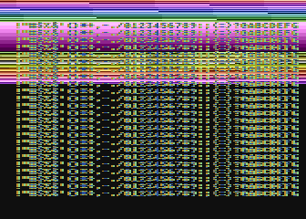

.. raw:: html

   <ul>
   <li><b>Source Code:</b> <a href="https://raw.githubusercontent.com/playermissile/dli_tutorial/master/src/dli_interrupting_vbi.s">dli_interrupting_vbi.s</a></li>
   <li><b>Executable:</b> <a href="https://raw.githubusercontent.com/playermissile/dli_tutorial/master/xex/dli_interrupting_vbi.xex">dli_interrupting_vbi.xex</a></li>
   </ul>

The vertical blank routine would have to be quite long *and* the DLI set very
early in the display list before this would happen.

.. note:: In my own game development, I have run into this effect happening intermittently, where occasionally the VBI runs very long due to some complicated game logic that happens only under certain conditions. It's something to be aware of.

In this example, this DLI is set on the final blank line of the display list,
so the display list begins with these bytes:

.. code-block::

   .byte $70,$70,$f0

triggering the DLI on scan line 24. The vertical blank has run from scan lines
248 through 262 on one frame, and through 23 scan lines of the following frame
before getting interrupted by the DLI.

To visualize the processing in the vertical blank, this example changes
background color as fast as it can once the vertical blank starts, up to the
100th scan line of the generated image. It gets interrupted on scan line 23 for
the DLI.

The DLI is one we've seen before, just changing background color with
``WSYNC``. Once it has completed, it returns and the VBI routine picks up where
it left off, changing background color as fast as it can.

DLI on the JVB Instruction
~~~~~~~~~~~~~~~~~~~~~~~~~~~~~~~~~~~~~

A DLI on the JVB instruction at the end of the display list is possible, but
has an interesting property: it triggers DLIs on every scan line until the
vertical blank.

If your DLI is not short enough, it will keep getting interrupted by the DLI
on triggered by the next scan line, stacking up interrupts until mercifully
the triggering process is stopped by the vertical blank after 248 scan lines
have been generated.

.. note:: As each new frame is generated in an emulator, it will enumerate the scan lines starting from zero. There are 248 scan lines before the vertical blank, which will be displayed as scan lines 0 - 247. The scan line labeled 248 will be the first scan line of the vertical blank.

After the vertical blank routine exits, the stacked-up DLI calls will have to
unwind themselves so the most recently interrupted DLI (from scan line 247,
the scan line just before the vertical blank) will resume and execute code
until its ``RTI``. This will pop data off the stack and return control to the
DLI that was interrupted on scan line 246, and so-forth until all the
interrupted DLIs have issued their ``RTI`` instructions.

On a standard length display list that generates 24 blank lines followed by
192 output lines, the JVB instruction will be on scan line 224. Since the JVB
technically generates a single blank line in the display list, the DLI will
also be triggered on scan line 224. This case would produce 24 DLIs before the
vertical blank.

DLIs in a Nutshell
-----------------------

DLIs provide you with a way to notify your program at a particular vertical
location on the screen. They pause (or interrupt) the normal flow of program
code, save the state of the machine, call your DLI subroutine, and restore the
state of the computer before returning control to the code that was
interrupted.

.. warning::

   Here are the requirements for successful use of DLIs:

   * your DLI routine must save any registers it clobbers
   * restore any registers you save before exiting
   * exit with an ``RTI``
   * use ``WSYNC`` if necessary
   * be aware of cycles stolen by ANTIC: you could have only 60 cycles per scan line in higher resolution graphics modes, and as few as 10 (**!**) on the first line of text modes
   * store the address of your routine in ``VDSLST`` before enabling DLIs with ``NMIEN``
   * guard against the DLI itself being interrupted

Note that nowhere in that list was the requirement that the DLI be short. It
doesn't have to be, and in fact DLIs that span multiple scan lines are similar
to kernels used in Atari 2600 programming. The difference is that ANTIC steals
cycles depending on a bunch of factors, so the total cycle counting approach
(or `Racing the Beam <https://mitpress.mit.edu/books/racing-beam>`_) is usually
not possible.

However, most DLIs that you will run across in the wild *are* short, because
they typically don't do a lot of calculations. Most of the setup work will
generally be done outside of the DLI and the DLI itself just handles the result
of that work.

.. raw:: html

   

   
   

Advanced DLI Examples
------------------------

The following examples are available in both source code form and as XEX files
at the `dli_tutorial source code repository <https://github.com/playermissile/dli_tutorial>`_ on github.

They are coded using MAC/65 assembler syntax, but very few assembler-specific
features are actually used, so they should be trivially ported to other
assemblers.

To get a copy of all the examples and source code, you can download and
install `git <https://git-scm.com/>`_ for your platform. Then open a command
line prompt on your computer and enter the command:

.. code-block:: bash

   git clone https://github.com/playermissile/dli_tutorial.git

to download the complete repository.

You can also download individual assembly source and XEX files from links in
each section.

In an attempt to de-clutter the examples as much as possible, most of the
boilerplate code (for initialization and setup tasks) has been placed in
libraries that are included during the compilation process. These are files
like ``util.s``, ``util_dli.s`` and so forth, and are available in the source code repository or directly `here <https://github.com/playermissile/dli_tutorial/src>`_.

Topic #1: DLI Positioning
----------------------------------

The following examples deal with various techniques regarding placing the DLI
on screen.

#1.1: Multiple DLIs
------------------------------------------------------------

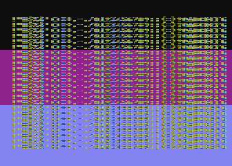

.. raw:: html

   <ul>
   <li><b>Source Code:</b> <a href="https://raw.githubusercontent.com/playermissile/dli_tutorial/master/src/multiple_dli_same_page.s">multiple_dli_same_page.s</a></li>
   <li><b>Executable:</b> <a href="https://raw.githubusercontent.com/playermissile/dli_tutorial/master/xex/multiple_dli_same_page.xex">multiple_dli_same_page.xex</a></li>
   </ul>

One of the problems with having a single DLI vector is: what do you do when you
want to have more than one DLI?

Some techniques that you will see in the wild:

 * use ``VCOUNT`` to check where you are on screen and branch accordingly
 * increment an index value and use that to determine which DLI has been called
 * change the ``VDLSTL`` vector to point to the next DLI in the chain

Here's an optimization of the last technique that can save some valuable
cycles: put your DLIs in the same page of memory and only change the low byte.

.. code-block::

           *= (* & $ff00) + 256 ; next page boundary
   
   dli     pha             ; only using A register, so save it to the stack
           lda #$55        ; new background color
           sta WSYNC       ; first WSYNC gets us to start of scan line we want
           sta COLBK       ; change background color
           lda #<dli2      ; point to second DLI
           sta VDSLST
           pla             ; restore A register from stack
           rti             ; always end DLI with RTI!
   
   dli2    pha             ; only using A register, so save it to the stack
           lda #$88        ; new background color
           sta WSYNC       ; first WSYNC gets us to start of scan line we want
           sta COLBK       ; change background color
           pla             ; restore A register from stack
           rti             ; always end DLI with RTI!
   
   
   vbi     lda #<dli       ; set DLI pointer to first in chain
           sta VDSLST
           lda #>dli
           sta VDSLST+1
           jmp XITVBV      ; always exit deferred VBI with jump here

This is a simplistic example, but keeping the high byte constant inside the
DLI saves 6 cycles (by obviating the need for changing the high byte with
``LDA #>dli2; STA VDLSTL+1``). That may be enough for this optimization to be
useful.

.. _moving_dli:

#1.2: Moving the DLI Up and Down the Screen
------------------------------------------------------------

The DLI subroutine itself doesn't directly know what scan line caused the
interrupt because all DLIs are routed through the same vector at ``VDLSTL``.
The only trigger is in the display list: the DLI bit on the display list
instruction.

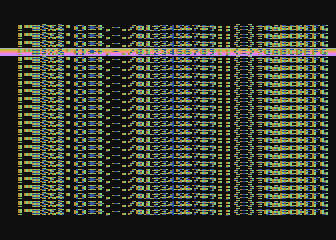

.. raw:: html

   <ul>
   <li><b>Source Code:</b> <a href="https://raw.githubusercontent.com/playermissile/dli_tutorial/master/src/moving_dli.s">moving_dli.s</a></li>
   <li><b>Executable:</b> <a href="https://raw.githubusercontent.com/playermissile/dli_tutorial/master/xex/moving_dli.xex">moving_dli.xex</a></li>
   </ul>

The display list can be modified in place to move the DLI to different lines
without changing any DLI code. The code to move the DLI should be performed in
the vertical blank to prevent the display list from being modified as ANTIC is
using it to create the display:

.. code-block::

   move_dli_line
           ldx last_dli_line ; get line number on screen of old DLI
           lda dlist_line_lookup,x ; get offset into display list of that line number
           tax
           lda dlist_first,x ; remove DLI bit
           and #$7f
           sta dlist_first,x
           ldx dli_line    ; get line number on screen of new DLI
           stx last_dli_line ; remember
           lda dlist_line_lookup,x ; get offset into display list of that line number
           tax
           lda dlist_first,x ; set DLI bit
           ora #$80
           sta dlist_first,x
           rts

The example allows the display list to be set on blank lines at the top of the
display, and on the last mode 4 line in the display list which displays the
background below the last mode 4 line on the screen.

.. _topic_color:

Topic #2: Colors
------------------------------------------

We have already seen several examples of using DLIs to show more colors on
screen. The following examples are included to address more topics in common
use in games or title screens.

#2.1: Marching Rainbow Text
------------------------------------------------------------

Using code almost identical to the :ref:`rainbow <rainbow_wsync>` effect, a common effect seen in title screens can be created:

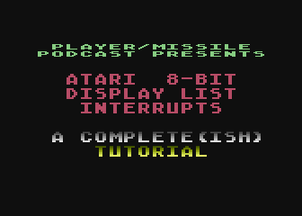

.. raw:: html

   <ul>
   <li><b>Source Code:</b> <a href="https://raw.githubusercontent.com/playermissile/dli_tutorial/master/src/marching_rainbow.s">marching_rainbow.s</a></li>
   <li><b>Executable:</b> <a href="https://raw.githubusercontent.com/playermissile/dli_tutorial/master/xex/marching_rainbow.xex">marching_rainbow.xex</a></li>
   </ul>

Using a simple display list:

.. code-block::

   dlist   .byte $70,$70,$70,$70,$70,$70  ; 48 blank lines
           .byte $46,<text,>text ; Mode 6 + LMS, setting screen memory to text
           .byte 6            ; Mode 6
           .byte $70,$70      ; 16 blank lines
           .byte 7,7,7        ; 3 lines of Mode 7
           .byte $70          ; 8 blank lines
           .byte $f0          ; 8 blank lines + DLI on last scan line
           .byte 7,7          ; 2 lines of Mode 7
           .byte $41,<dlist,>dlist ; JVB, restart same display list on next frame

the DLI simply loads the ``start_color`` variable as the initial color each
time it is called, then increments the value stored in the hardware color
register for playfield color zero (``COLPF0``) as it makes ``WSYNC`` calls to
advance one scan line down the screen. Each scan line increases luminance (i.e.
gets brighter), until the low 4 bits controlling the luminance overflows into
the high 4 bits, changing the color to the next in the Atari's color palette at
zero luminance.

.. code-block::

   dli     pha             ; save A & X registers to stack
           txa
           pha
           ldx #32         ; make 32 color changes
           lda start_color ; initial color
           sta WSYNC       ; first WSYNC gets us to start of scan line we want
   ?loop   sta COLPF0      ; change text color for UPPERCASE characters in gr2
           clc
           adc #$1         ; change color value, making brighter
           dex             ; update iteration count
           sta WSYNC       ; sta doesn't affect processor flags
           bne ?loop       ; we are still checking result of dex
           lda #text_color ; reset text color to normal color
           sta COLPF0
           dec start_color ; change starting color for next time
           pla             ; restore X & A registers from stack
           tax
           pla
           rti             ; always end DLI with RTI!

At the end of the DLI, ``start_color`` is *decremented*, meaning that the next
time the DLI is called it will start with one luminance value lower than it did
last time. This gives the appearance of the previous rainbow of color being
"pushed" down the screen and a new darker line being inserted at the top of the
rainbow.

Changing that ``dec start_color`` to ``inc start_color`` would have the
opposite effect and the rainbow of color would appear to move upward.

Alternatively, leaving the ``dec start_color`` but changing the ``clc``, ``adc
#$1`` to:

.. code-block::

           sec
           sbc #$1         ; change color value, making darker

would have the same effect as ``inc start_color``.

.. _topic_chbase:

Topic #3: Character Sets
------------------------------------------

The character set on the Atari is comprised of 128 glyphs, each of which is 8
bytes in size for a total of 1024 bytes for a complete font. The characters are
defined in ANTIC font order, not ATASCII order, so the first 64 characters are
the ATASCII characters 32 - 95 (symbols, numbers, and upper case letters), the
next 32 are the graphic symbols on the control characters, and the final 32 are
the lower case letters and a few remaining graphic symbols.

.. seealso:: More resources about character sets are available:

   * ``CHBAS`` in `Mapping the Atari <https://www.atariarchives.org/mapping/memorymap.php#756>`_
   * ``CHBASE`` in `Mapping the Atari <https://www.atariarchives.org/mapping/memorymap.php#54281>`_
   * `Mapping the Atari, Appendix 10 <https://www.atariarchives.org/mapping/appendix10.php>`_

.. _changing_chbase:

#3.1: Changing Character Sets
------------------------------------------------------------

An extremely simple DLI is all that's needed to change the character set at a
particular scan line.

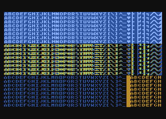

.. raw:: html

   <ul>
   <li><b>Source Code:</b> <a href="https://raw.githubusercontent.com/playermissile/dli_tutorial/master/src/simple_chbase.s">simple_chbase.s</a></li>
   <li><b>Executable:</b> <a href="https://raw.githubusercontent.com/playermissile/dli_tutorial/master/xex/simple_chbase.xex">simple_chbase.xex</a></li>
   </ul>

This example uses two character sets: the default character set at the top of
the screen, and an character set designed for ANTIC 4 for the bottom. The
screen is broken up into 3 bands, one set of 8 lines of ANTIC mode 2 and two
sets each containing 8 lines of ANTIC mode 4. The top two bands have the normal
character set (``CHBASE = $e000``) and the bottom band has a custom character
set designed for the 5 color mode.

The DLI is set on the 16th text line: the final line in the second band of 8
lines so that the character set change affects the 3rd band of 8 lines:

.. code-block::

   ; mixed mode 2 and mode 4 display list
   dlist_static
           .byte $70,$70,$70
           .byte $42,$00,$80
           .byte 2,2,2,2,2,2,2     ; first band has 8 lines of mode 2
           .byte 4,4,4,4,4,4,4,$84 ; 2nd band: 8 lines of mode 4 + DLI on last line
           .byte 4,4,4,4,4,4,4,4   ; 3rd band: 8 lines of mode 4
           .byte $41,<dlist_static,>dlist_static

The font for the top of the screen is set during the ``init`` routine using the
the shadow register ``CHBAS``, not the hardware register ``CHBASE``. It will be
reloaded every vertical blank by the operating system:

.. code-block::

           lda #$e0
           sta CHBAS

The DLI is very simple, just loading the new character set, but this time using
the hardware register ``CHBASE``:

.. code-block::

   dli     pha             ; only using A register, so save it to the stack
           lda #>font_data ; page number of new font data
           sta WSYNC       ; first WSYNC gets us to start of scan line we want
           sta CHBASE      ; store to hardware register to affect change immediately
           pla             ; restore A register from stack
           rti             ; always end DLI with RTI!

Topic #4: Player/Missile Graphics
---------------------------------------------

Player/Missile Graphics is the sprite system provided by the GTIA:
independently positioned overlays on the playfield graphics that don't disturb
the playfield.

.. note:: the word *sprite* in this sense wasn't in use when the Atari was designed, and `several <https://graphics.fandom.com/wiki/Sprite>`_ `sources <https://en.wikipedia.org/wiki/Sprite_(computer_graphics)>`_ `claim <http://groups.google.com/group/comp.sys.ti/msg/73e2451bcae4d91a>`_ that it was coined by the designers of the Texas Instruments TI 9918 graphics chip at about the same timeframe.

The GTIA provides 4 players with independent colors (from each other or the
playfield) and 4 missiles with colors matching their respective player, or the
4 missiles can be combined into a 5th player with its own color (although this
reuses one playfield color). The players are 8 bits wide and can be displayed
as one, two, or four color clocks wide per bit. This corresponds a width on
screen of 8, 16, and 32 color clocks, respectively. Widths for all players and
missiles can be set independently.

Each player and missile can be positioned at an arbitrary horizontal location
by setting a hardware register, but vertical positioning requires copying data
to particular locations in the memory area reserved for it. Each player spans
the height of the screen, and it is only the bit pattern in its storage area
that determines what is drawn on a particular scan line.

Missiles are two bits wide each with all 4 missiles packed into a single byte
for a particular scan line. Bit masking is required to set data for one
missile without affecting the others.

The quick summary for our purposes is that horizontal repositioning of players
is fast, it takes only a single store instruction. Vertical repositioning of
player image data is slow, it requires copying memory around.

#4.1: Multiplexing Players Vertically
----------------------------------------------------------------

Reusing players (multiplexing) vertically is straightforward, meaning that a
single player can be used to display arbitrary images at different vertical
locations on the screen, provided that there is no vertical overlap.

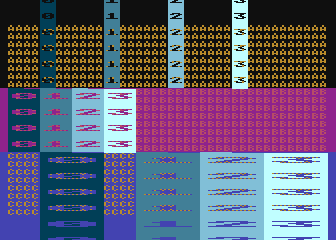

.. raw:: html

   <ul>
   <li><b>Source Code:</b> <a href="https://raw.githubusercontent.com/playermissile/dli_tutorial/master/src/simple_multiplex_player.s">simple_multiplex_player.s</a></li>
   <li><b>Executable:</b> <a href="https://raw.githubusercontent.com/playermissile/dli_tutorial/master/xex/simple_multiplex_player.xex">simple_multiplex_player.xex</a></li>
   </ul>

Using the hardware ``HPOSPn`` or ``HPOSMn`` registers, the DLI will
immediately change where ANTIC will draw the player or missile. The next time
ANTIC draws the player on a scan line, it will use this new position.

in the appropriate player or missile X position register. This demo uses the
page-alignment trick for the second DLI, and changes the position and size of
the players at each interrupt.

This demo splits the screen vertically into 3 horizontal bands, A, B & C, with
the players extending the full height of the screen and labeled 0 through 3.
This example uses the VBI to set the players for band A, the ``dli`` routine
is the bottom of band A (and the top of band B) and therefore sets the players
for band B, and the ``dli2`` routine is the bottom of band B (and the top of
band C) and controls the players for band C.

.. code-block::

   vbi     lda #<dli       ; set DLI pointer to first in chain
           sta VDSLST
           lda #>dli
           sta VDSLST+1
           lda #$40        ; set player positions and sizes ...
           sta HPOSP0      ;   for the top of the screen
           lda #$60
           sta HPOSP1
           lda #$80
           sta HPOSP2
           lda #$a0
           sta HPOSP3
           lda #0
           sta SIZEP0
           sta SIZEP1
           sta SIZEP2
           sta SIZEP3
           jmp XITVBV      ; always exit deferred VBI with jump here
   
           *= (* & $ff00) + 256 ; next page boundary
   
   dli     pha             ; only using A register, so save it to the stack
           lda #$55        ; new background color
           sta WSYNC       ; first WSYNC gets us to start of scan line we want
           sta COLBK       ; change background color
           lda #$30        ; change position and sizes of players
           sta HPOSP0
           lda #$40
           sta HPOSP1
           lda #$50
           sta HPOSP2
           lda #$60
           sta HPOSP3
           lda #1
           sta SIZEP0
           sta SIZEP1
           sta SIZEP2
           sta SIZEP3
           lda #<dli2      ; point to second DLI
           sta VDSLST
           pla             ; restore A register from stack
           rti             ; always end DLI with RTI!
   
   dli2    pha             ; only using A register, so save it to the stack
           lda #$84        ; new background color
           sta WSYNC       ; first WSYNC gets us to start of scan line we want
           sta COLBK       ; change background color
           lda #$40        ; change position and sizes of players
           sta HPOSP0
           lda #$70
           sta HPOSP1
           lda #$90
           sta HPOSP2
           lda #$b0
           sta HPOSP3
           lda #3
           sta SIZEP0
           sta SIZEP1
           sta SIZEP2
           sta SIZEP3
           pla             ; restore A register from stack
           rti             ; always end DLI with RTI!

In discussing the timing issues that cause errors at the band boundaries, the
players in band A are positioned by the VBI, and so are in place from well off
the top of the screen and are correctly positioned at the first scan line.
Players 0, 1, and 2 are correct at the bottom of the band, but player 3
extends one scan line too far, into band B.

The top of band B shows both position and size errors. When the first DLI hits
on the last scan line of the 6th line of text, the background color is changed
at the ``WSYNC`` and ANTIC moves on to start drawing the first scan line of
the 7th line of text (which is the first line of text in band B.) Players 0,
1, and 2 are positioned correctly, which means their horizontal positions were
set before ANTIC reached that portion of the scan line. The 3rd player remains
in the same position as it was in band A, meaning that its horizontal position
wasn't set in time. ANTIC had stolen enough cycles setting up the mode 4 font
that the 6502 didn't get a chance to process the ``sta HPOS3`` before ANTIC
had to draw that portion of the scan line. Since the code sets sizes after the
horizontal positions, none of the sizes are set until the 2nd scan line of
band B.

The transition to band C with the ``dli2`` routine produces similar results,
there just isn't enough time with the ``WSYNC`` used for the color change
*and* all the cycles stolen by ANTIC mode 4 to process the all of the player
changes in the first scan line of the band. Players 0, 1, and 2 are moved,
player 3 is not, and all 4 players don't get the correct size until the 2nd
scan line of the band.

It's possible to imagine a scenario where a scan line of a player is not
visible at all. For example, if player 3 above had been positioned very far to
the right and ``HPOSP3`` was changed to move player 3 to the far left side, it
could be possible that ANTIC has already drawn the left side of the screen but
hadn't yet reached the right side where player 3 had been positioned. Because
``HPOSP3`` is now showing that player 3 is on the left side of the screen,
ANTIC would not draw it at its old location on the right side of the screen.

It's also possible, with careful timing, to reuse a player on a single line.
However, purposeful use of this would difficult given all the different
horizontal locations of ANTIC's cycle stealing.

Mode 4 was chosen (in all of its cycle-stealing glory) for these examples to
get an idea of the worst-case scenerio. Taking out the ``WSYNC`` and the color
change did allow enough time that both the positions and sizes were changed
without visible artifacts:

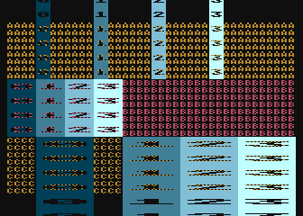

but this is very simple code and the more real-world example in the next
section will show that a buffer zone of several scan lines is necessary to
make sure a player isn't split across a band boundary or, as described above,
even duplicating a line of the player or missing a scan line.

#4.2: Multiplexing With Horizontal Motion
----------------------------------------------------------

Increasing the number of bands and adding independent player movement within
each band requires some data structures and a DLI to control placement in each
band.

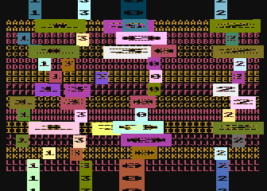

.. raw:: html

   <ul>
   <li><b>Source Code:</b> <a href="https://raw.githubusercontent.com/playermissile/dli_tutorial/master/src/multiplex_player_movement.s">multiplex_player_movement.s</a></li>
   <li><b>Executable:</b> <a href="https://raw.githubusercontent.com/playermissile/dli_tutorial/master/xex/multiplex_player_movement.xex">multiplex_player_movement.xex</a></li>
   </ul>

The approach used in this example is to use a single DLI that uses an index
value to determine which band it is operating within. This index value is used
as an offset into arrays that hold the sprite X position, size, color, etc.

There are a lot of independently moving objects in this demo: 12 bands, each
with 4 players. There are very obvious timing issues in most bands on the
first scan line after the DLI as sometimes the hardware registers for a player
hasn't been updated fully until the second scan line.

.. code-block::

   ; same DLI routine is used for each band, the band_dli_index is used to set
   ; player information for the appropriate band
   dli_band
           pha             ; using A & X
           txa
           pha
           inc band_dli_index ; increment band index, VBI initialized to $ff,
           ldx band_dli_index ;   so will become 0 for band A
   
           ; control band X positions of players
           lda bandp0_x,x  ; x position of player 0 in this band
           sta HPOSP0
           lda bandp0_color,x ; color of player 0 for this band
           sta COLPM0
           lda bandp0_size,x ; size of player 0 for this band
           sta SIZEP0
   
           lda bandp1_x,x  ; as above, but for players 1 - 3
           sta HPOSP1
           lda bandp1_color,x
           sta COLPM1
           lda bandp1_size,x
           sta SIZEP1
   
           lda bandp2_x,x
           sta HPOSP2
           lda bandp2_color,x
           sta COLPM2
           lda bandp2_size,x
           sta SIZEP2
   
           lda bandp3_x,x
           sta HPOSP3
           lda bandp3_color,x
           sta COLPM3
           lda bandp3_size,x
           sta SIZEP3
   
   ?done   pla             ; restore A & X
           tax
           pla
           rti             ; always end DLI with RTI!

The addreses ``bandpN_x``, ``bandpN_color``, and ``bandpN_size`` (where N is
the player number) are declared as lists with the number of entries equal to
the number of bands. ``band_dli_index`` is incremented each time the DLI
starts, and uses that index into the lists so it places the players in the
correct location for that band.

Notice that is *all* the DLI does. It does not calculate movement or perform any
player logic, it simply puts players on the screen in the appropriate place for
that band. All the calculation is done in the vertical blank:

.. code-block::

   ; calculate new positions of players in all bands
   vbi     ldx #0
   ?move   lda bandp0_x,x  ; update X coordinate
           clc             ;   by adding velocity.
           adc bandp0_dx,x ;   Note that velocity of $ff
           sta bandp0_x,x  ;   is same as -1
           cmp #$30        ; check left edge
           bcs ?right      ; if >=, it is still in playfield
           lda #1          ; nope, <, so make velocity positive
           sta bandp0_dx,x
           bne ?cont
   ?right  cmp #$c0        ; check right edge
           bcc ?cont       ; if <, it is still in playfield
           lda #$ff        ; nope, >=, so make velocity negative
           sta bandp0_dx,x
   ?cont   inx             ; next player
           cpx #num_dli_bands * 4 ; loop through 12 bands * 4 players each
           bcc ?move
   
           lda #$ff        ; initialize band index to get ready for band A
           sta band_dli_index
           jmp XITVBV      ; always exit deferred VBI with jump here

Unlike the simple multiplexing demo in the previous section, this VBI does not
set any positions of players. Instead, this demo sets the DLI bit on the last
group of 8 blank lines at the beginning of the display list, before any mode 4
lines. This initial DLI will set the players for band A, and as you can see in
the demo the players above band A use the same X position and size as band L.
The colors are not the same as band L, however, because of the use of the
shadow registers to set the initial color in the ``init_pmg`` subroutine.

#4.3: Reusing Players Horizontally
----------------------------------------------------------------

Reusing players on the same scan line is possible, but requires cycle counting
and has limitations, especially in text modes. The complicated cycle stealing
performed by ANTIC will require consulting timing reference charts (such as in
the Altirra Hardware Reference Manual) to determine how well it can be used for
a particular graphics mode.

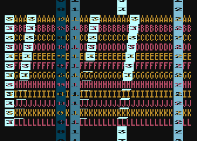

.. raw:: html

   <ul>
   <li><b>Source Code:</b> <a href="https://raw.githubusercontent.com/playermissile/dli_tutorial/master/src/reusing_player_horz.s">reusing_player_horz.s</a></li>
   <li><b>Executable:</b> <a href="https://raw.githubusercontent.com/playermissile/dli_tutorial/master/xex/reusing_player_horz.xex">reusing_player_horz.xex</a></li>
   </ul>

Here's the DLI that produces the effect above, where player 3 has multiple
copies at the same vertical position. Again there are 12 vertical bands (this
time ANTIC mode 5), where the first copy of player 3 is at the left side of the
screen and the other 3 shift slowly to the left as it moves down bands in
order to find the minimum possible horizontal shift between copies. This is
not a kernel (see the next section for that), so the DLI bit is set on each of
the mode 5 lines.

.. code-block::

   dli     pha             ; using A & X
           txa
           pha
   
           dec copy1       ; move copies to the left one color clock each band
           dec copy2
           sta WSYNC       ; skip rest of last line of DLI line
           dec copy3       ; not enough time to do all 3 decrements before 1st WSYNC
           ldx #14         ; prepare for 14 scan lines in the loop
           sta WSYNC       ; skip 1st line of mode 5 where ANTIC steals almost all cycles
   ?loop   lda #48         ; set initial position of player 3
           sta HPOSP3
           nop             ; we're still on the tail end of the prevous scan
           nop             ;   line, so we need to wait until the electron beam
           nop             ;   passes this first position before we set the
           nop             ;   next HPOS.
           nop
           nop
           lda copy1       ; can't place copies until after electron beam draws
           sta HPOSP3      ;   the player in the previous location. If you try
           lda copy2       ;   to move HPOSP3 too early, the previous location
           sta HPOSP3      ;   won't even get drawn. Too late, and it won't draw
           lda copy3       ;   anything in the current location.  It's a battle.
           sta HPOSP3
           dex
           beq ?done
           sta WSYNC
           bne ?loop

   ?done   pla             ; restore A & X
           tax
           pla
           rti             ; always end DLI with RTI!

This requires a VBI to reset the starting horizontal position at the top of
each frame.

.. code-block::

   vbi     lda #68         ; reset position counters for each copy of player 3
           sta copy1
           lda #122
           sta copy2
           lda #156
           sta copy3
           jmp XITVBV      ; always exit deferred VBI with jump here

There is a lot to unpack here.

First: using a text mode is a mistake because ANTIC steals so many cycles on
the first scan line that there's no way to place copies on that scan line. On
subsequent lines, there is enough time to make multiple copies of a player
except for the last line that will have to contain the ``RTI`` instruction.
However, because this is not using a kernel- style DLI where it takes control
for all 192 lines, the ``RTI`` has to happen before the last scan line so
there is enough time for the interrupt processing for the next DLI without the
the current DLI getting interrupted, which would then stack interrupts and
cause scan line offsets.

Second: notice the bands places in which the number **3** isn't drawn in the
player, instead only a single scan line in the player 3 color appears. This
means there are not enough available cycles to set the new position of the
player before the electron beam has already passed the desired horizontal
position.

The takeaways here:

 * the cycle counting necessary will be much easier using bitmap modes
 * it will probably be more successful to use a kernel rather than multiple DLIs
 * the author may revisit this technique at some point, but for now will leave further exploration to the reader, assuming the reader is much more patient regarding cycle counting than the author.

#4.x: Multiplexing with Arbitrary Motion
-------------------------------------------------------

Vertical movement within bands requires the moving memory around the
player/missile graphics area (pointed to by ``PMBASE``) as in normal usage,
with the following limitations:

 * players must stay within their assigned band, otherwise they will get split across bands when the DLI occurs.
 * players should avoid the first few scan lines below the top of the band boundary to prevent splitting
 * when moving a player vertically within a band, only erase data from that band to prevent affecting the multiplexed players in other bands

<example goes here>

#4.x: Multiplexing With Collision Detection
---------------------------------------------------------------

If it is important to tell in which band a has collided occurred, the DLI that
starts a new band will be required to save the collision status registers,
which will determine if a collision happened in the *previous* band. It will
then reset the collision registers so the following DLI can check what
happened in this band.

If the knowledge of the band is not important, you can just check the
collision registers in the vertical blank, which will report if there have
been any collisions with anything in any band.

<example goes here>

Topic #5: Kernels
-------------------------------------

The concept of a kernel comes from Atari 2600 programming. The 2600 does not
have enough memory to store an entire frame -- it has a line buffer, rather
than a frame buffer. To create a graphic image with any vertical detail, the
code must build the screen line-by-line, changing graphic information as the
electron beam moves down the screen.

Kernels for our purposes will be DLIs that take control for many scan lines to
perform graphic operations that are not possible otherwise. We have seen
horizontal positioning of players accomplished with a traditional DLI setup
with interrupts on multiple display list commands. It could have been
performed using a kernel, which (assuming the graphics mode is bitmapped
rather than text) would have removed the restriction created by need for extra
cycles near the ``RTI`` instruction.

Kernels are a very advanced topic. The Atari 8-bit computers are the direct
successor to the 2600, and the ANTIC and GTIA were designed to automate common
tasks that in the 2600 requires kernel programming. Because so much is possible
without kernels, this tutorial is not going to spend much time with this topic.
However, a few examples are presented here to give you an idea of how they
work.

#5.1: Background Color Change Within Scan Line
--------------------------------------------------

A simple kernel can be used to change the background color to "split" the
screen horizontally. Having learned a lesson or two, the author is using a
graphics mode for the following example, mode E (the 160x192, 4 color mode):

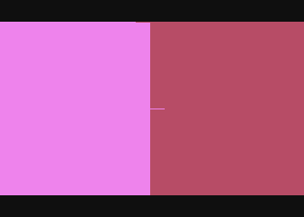

.. raw:: html

   <ul>
   <li><b>Source Code:</b> <a href="https://raw.githubusercontent.com/playermissile/dli_tutorial/master/src/background_color_kernel.s">background_color_kernel.s</a></li>
   <li><b>Executable:</b> <a href="https://raw.githubusercontent.com/playermissile/dli_tutorial/master/xex/background_color_kernel.xex">background_color_kernel.xex</a></li>
   </ul>

which does show much more (but not complete!) uniformity. The problem scan
lines are the first and somewhere in the middle. Here's the DLI:

.. code-block::

   dli     pha             ; using all registers
           txa
           pha
           tya
           pha
   
           ldy #192
           sta WSYNC       ; initialize to near beginning of first scan line of interest
   ?loop   lda #90         ; set background color
           sta COLBK
           nop             ; wait for some time
           nop
           nop
           nop
           nop
           nop
           nop
           nop
           nop
           nop
           nop
           nop
           nop
           lda #70         ; after 1st copy is drawn but before electron beam
           sta COLBK
           dey
           sta WSYNC
           bne ?loop
   
           lda #0
           sta COLBK
   
   ?done   pla             ; restore all registers
           tay
           pla
           tax
           pla
           rti             ; always end DLI with RTI!

The code shows lots of waiting around. Using cycle counting of opcodes is the
finest level of precision for direct manipulation of the graphics screen.
There's no way to get accuracy down to an individual color clock, unless the
timing happens to work out that the instruction duration combined with the
particular cycles on which ANTIC pauses the CPU to do its work happen to fall
on the color clock you're interested in.

The issue on the first scan line is caused by the first ``WSYNC`` not being
immediately followed by a branch instruction as in all subsequent calls to
``WSYNC``. Solving this requires an extra delay added after that first
``WSYNC``.

Examining the display list will probably make it obvious where the problem scan
line is in the middle of the screen:

.. code-block::

   ; mode E standard display list
   dlist_static_modeE
           .byte $70,$70,$70
           .byte $4e,$00,$80
           .byte $e,$e,$e,$e,$e,$e,$e,$e,$e,$e,$e,$e,$e,$e,$e,$e
           .byte $e,$e,$e,$e,$e,$e,$e,$e,$e,$e,$e,$e,$e,$e,$e,$e
           .byte $e,$e,$e,$e,$e,$e,$e,$e,$e,$e,$e,$e,$e,$e,$e,$e
           .byte $e,$e,$e,$e,$e,$e,$e,$e,$e,$e,$e,$e,$e,$e,$e,$e
           .byte $e,$e,$e,$e,$e,$e,$e,$e,$e,$e,$e,$e,$e,$e,$e,$e
           .byte $e,$e,$e,$e,$e,$e,$e,$e,$e,$e,$e,$e,$e,$e,$e
           .byte $4e,$00,$8f  ; yep, it's right here
           .byte $e,$e,$e,$e,$e,$e,$e,$e,$e,$e,$e,$e,$e,$e,$e,$e
           .byte $e,$e,$e,$e,$e,$e,$e,$e,$e,$e,$e,$e,$e,$e,$e,$e
           .byte $e,$e,$e,$e,$e,$e,$e,$e,$e,$e,$e,$e,$e,$e,$e,$e
           .byte $e,$e,$e,$e,$e,$e,$e,$e,$e,$e,$e,$e,$e,$e,$e,$e
           .byte $e,$e,$e,$e,$e,$e,$e,$e,$e,$e,$e,$e,$e,$e,$e,$e
           .byte $e,$e,$e,$e,$e,$e,$e,$e,$e,$e,$e,$e,$e,$e,$e
           .byte $41,<dlist_static_modeE,>dlist_static_modeE

Because ANTIC can't cross a 4k memory boundary (it only has 12 address lines,
2^12 = 4096), the display list for full screen display of modes D, E, and F
must be broken up into two sections of about 4K each. The ``LMS`` instruction
``$4e`` causes ANTIC to steal 2 cycles to read those two bytes that hold the
screen address, which delays the timing by 2 cycles and forces the color
change to happen later than desired. This problem wouldn't happen with a
display list of modes A, B, and C, for instance, because their maximum use of
memory is less than 4k.

Solving this problem requires some extra handling after 95 scan lines have
passed in order to remove a bit of delay before changing the background color.

But the author doesn't find that this particular example would be very useful
in actual games, so the next section will look at a technique using a kernel
that is in common use in games: the multicolor player.

#5.x: Multicolor Player
-------------------------------------------------------

We have seen DLIs being used to change player position, size, and color. Until
now, these demos have been limited to particular vertical bands on screen.
Changing player attributes at an arbitrary location on screen will require a
kernel-style DLI.

.. note:: Strictly speaking, this is not true. If players do not overlap vertically, or only a single player needs to have characteristics adjusted, a `moving DLI <moving_dli_>`_ technique could work.

<example goes here>

Topic #6: Scrolling
-----------------------------------------

.. note:: Scrolling is a large topic; so large, in fact, that I wrote an :ref:`additional tutorial <scrolling_tutorial>`about it!

Display lists provide the ability to easily perform course scrolling without
moving any display memory around. Instead, the visible display can be adjusted
to provide scrolling at byte resolution by adjusting the address pointed to by
any LMS instructions in the display list. The amount of graphical detail in a
byte depends on the graphics mode: character modes by definition are one
character per byte so the course scrolling limits are a single character
vertically or horizontally. Bitmap modes can be 1 to 8 scan lines tall per
byte, and 4 or 8 color clocks wide per byte.

The Fine scrolling hardware registers provide the bridge between byte size and
scan lines (vertically) or color clocks (horizontally; and note that a color
clock in the smallest unit for horizontal scrolling, even in mode F).
Vertically the ``VSCROL`` hardware register allows fine scrolling up to 16
scan lines, and horizontally the ``HSCROL`` register provides up to 16 color
clocks fine scrolling.

Continuous fine scrolling requires the use of both fine scrolling and course
scrolling techniques, with the fine scrolling used until the size limit of the
particular graphics mode is reached, then using course scrolling to move the
display list to point to the next byte in memory while simultaneously
resetting the fine scrolling register back to its starting point. Vertically,
the size limit is the height in scan lines of the mode, and horizontally is
the number of color clocks wide.

.. seealso::

 * `De Re Atari, Chapter 6 <https://www.atariarchives.org/dere/chapt06.php>`_
 * Mapping the Atari: `HSCROL <https://www.atariarchives.org/mapping/memorymap.php#54276>`_ and `VSCROL <https://www.atariarchives.org/mapping/memorymap.php#54277>`_
 * my own :ref:`Fine Scrolling: A Complete(ish) Tutorial <scrolling_tutorial>`

.. _parallax_scrolling:

#6.1: Parallax Scrolling
------------------------------------------------------------------

The "Moon Patrol" effect is actually very straightforward on the Atari, since
splitting up the screen vertically is among the strengths of ANTIC.

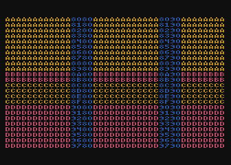

.. raw:: html

   <ul>
   <li><b>Source Code:</b> <a href="https://raw.githubusercontent.com/playermissile/dli_tutorial/master/src/parallax_scrolling.s">parallax_scrolling.s</a></li>
   <li><b>Executable:</b> <a href="https://raw.githubusercontent.com/playermissile/dli_tutorial/master/xex/parallax_scrolling.xex">parallax_scrolling.xex</a></li>
   </ul>

This effect does require a DLI because the ``HSCROL`` value is stored in an
ANTIC hardware register and remains in effect until changed. It is nominally
for full-screen scrolling, but since ANTIC has no memory of what it has done
in the past, there is every reason to use the capability and modify it in the
middle of the screen. The DLI is extremely simple, it just changes ``HSCROL``
to a previously-computed value at for band:

.. code-block::

   ; same DLI routine is used for each band, the band_dli_index is used to;
   ; determine which band we're in
   dli_band
           pha             ; using A & X
           txa
           pha
           inc band_dli_index ; increment band index, VBI initialized to $ff,
           ldx band_dli_index ;   so will be 0 for band B (band A doesn't scroll!)
   
           lda band_hscrol,x ; change HSCROL for this band
           sta HSCROL
   
   ?done   pla             ; restore A & X
           tax
           pla
           rti             ; always end DLI with RTI!

The calculation of each band's ``HSCROL`` value is performed in the VBI.

.. code-block::

   ; calculate new scrolling positions of bands
   vbi     ldx #2
   ?move   lda band_hscrol_frac,x  ; update scrolling position fraction
           clc                     ;   by adding velocity fraction.
           adc band_hscrol_frac_delta,x
           sta band_hscrol_frac,x
           lda band_hscrol,x       ; update scrolling position whole number
           adc #0
           sta band_hscrol,x
           cmp #4          ; 4 color clocks in Antic 4; check if need a course
           bcc ?nope       ;   scroll
   
           ; course scroll needed, chech which region
           cpx #0
           bne ?ckb
           jsr course_scroll_b
           bcc ?next       ; CLC in subroutine to allow branch
   
   ?ckb    cpx #1
           bne ?chc
           jsr course_scroll_c
           bcc ?next       ; CLC in subroutine to allow branch
   
   ?chc    jsr course_scroll_d
   
   ?next   lda #0          ; reset HSCROL for this band
           sta band_hscrol,x
   
   ?nope   dex
           bpl ?move
   
           lda #$ff        ; initialize band index to get ready for the first
           sta band_dli_index ;   DLI which affects band B
   
           lda #0          ; always reset HSCROL to zero for top of new screen
           sta HSCROL
   
           jmp XITVBV      ; always exit deferred VBI with jump here

For this demo, band C is running two times faster than band B, and band D is
running two times faster than band C. To allow some future speed modification
and to prevent the demo from running too fast, it is actually operating on two-
byte, fixed-point math: fractions of an ``HSCROL`` value. Every VBI, the low
byte (representing the fraction out of 256) changes by 32, 64, or 128
depending on the band (B, C, and D, respectively), and when the low byte
overflows, the high byte (and therefore ``HSCROL``) is updated.

#6.2: Multiple Scrolling Regions
------------------------------------------------------------------

Splitting the screen vertically allows 2 (or more!) independent scrolling
regions by changing the VSCROL and HSCROL values in the DLI so that the
subsequent lines use different values.

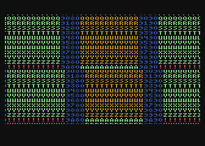

.. raw:: html

   <ul>
   <li><b>Source Code:</b> <a href="https://raw.githubusercontent.com/playermissile/dli_tutorial/master/src/multiple_scrolling_regions.s">multiple_scrolling_regions.s</a></li>
   <li><b>Executable:</b> <a href="https://raw.githubusercontent.com/playermissile/dli_tutorial/master/xex/multiple_scrolling_regions.xex">multiple_scrolling_regions.xex</a></li>
   </ul>

<example goes here>

