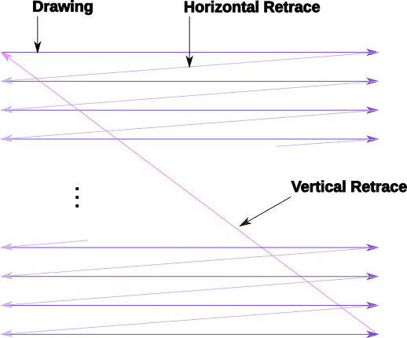

.. _dli_tutorial:

.. highlight:: ca65

A Crash Course on Advanced DLIs
=================================================================

.. centered:: **Atari 8-bit Display List Interrupts: An Advanced Tutorial**

This is a tutorial on advanced Display List Interrupts (DLIs) for the Atari
8-bit series of computers. In a nutshell, DLIs provide a way to notify your
program when a particular scan line is reached, allowing you to make changes
mid-screen.

DLIs are an advanced programming technique in the sense that they require
knowledge of 6502 assembly language, so this tutorial is going to assume that
you are comfortable with that. All the examples here are assembled using the
MAC/65-compatible assembler `ATasm
<https://atari.miribilist.com/atasm/index.html>`_ (and more specifically to
this tutorial, the version built-in to Omnivore).

Before diving into DLIs, it is helpful to understand that they are very
accurately named: Display List Interrupts literally interrupt the display list
-- they cause an event that is processed by your program while the ANTIC is drawing the screen. So it is necessary to understand what display lists are
before understanding what it means to interrupt one.

.. seealso::

   Here are some resources for learning more about display list interrupts:

   * `De Re Atari, Chapter 5 <https://www.atariarchives.org/dere/chapt05.php>`_
   * `Yaron Nir's tutorial using cc65 <https://atariage.com/forums/topic/291991-cc65-writing-a-dli-tutorial/>`_

A Crash Course on Displays
--------------------------------

A TV screen is drawn by an electron beam tracing a path starting above the
visible area, and drawing successive horizontal lines as the beam moves down
the screen. Each line is drawn from left-to-right (as you look at the TV
screen) and when it reaches the right hand side of the screen, the horizontal
retrace starts where the beam is turned off and moved down to the next scan
line below whereupon the beam is turned back on and the next line draws. When
the full frame has been drawn, the beam is turned off again and the vertical
retrace starts (starting the vertical blank interval). Once the beam is
repositioned to the top leftmost position, the vertical blank interval ends,
the beam is turned back on, and the next frame is started.

On NTSC systems, the Atari draws 262 scan lines per frame, 60 times per second.
On PAL systems it draws 312 scan lines per frame, 50 times per second. In
either system, it draws scan lines from the top down, and left to right within
a scan line.

This simplified description is the mental model we will use to describe the
video drawing process.

How TVs really (well, kinda approximately) work
~~~~~~~~~~~~~~~~~~~~~~~~~~~~~~~~~~~~~~~~~~~~~~~~

Real TVs are interlaced with 525 scan lines for NTSC and 625 for PAL. Because
of `reasons <https://en.wikipedia.org/wiki/NTSC#Lines_and_refresh_rate>`_, the
NTSC vertical refresh interval is not exactly the whole number of 60Hz either,
it's 60/1001 Hz or 59.94Hz. PAL refresh rate is apparently `exactly 50Hz
<http://martin.hinner.info/vga/pal.html>`_.

Every refresh interval, the electron beam draws one **field**, starting at the
top left and drawing every other scan line. When it reaches the bottom, the
vertical retrace starts, but this time it positions the electron beam at the
first missing scan line. Then it draws the next field, again skipping every
other scan line but this time filling in the scan lines it missed.

.. figure:: electron-beam-interlaced.png
   :align: center

Notice that this would mean that e.g. one NTSC frame should draw 262 scan lines
and the other 263, but apparently TVs can compensate for the missing scan line
every alternate frame, so the Atari always outputs 262 scan lines. Practically
speaking, you do not need to care that the screen is interlaced. If the Atari
is displaying an unchanging screen, it produces the same information in the 262
scan lines it generates regardless of which field it is drawing.

How TVs produce the colors that they display is very complicated and so far
outside the scope of this tutorial that it might as well be magic. Suffice it
to say that color happens.

On the Atari, a unit called the color clock is the smallest portion of a scan
line that can be displayed with an arbitrary color. There are 228 color clocks
per scan line, of which about 160 were typically visible on a cathode-ray TV
display in the 1970s when the Atari was developed. This corresponds to the 160
pixel horizontal resolution of Antic Modes B through E in the standard width
playfield. Antic Mode F (Graphics 8 in BASIC) has 320 addressable pixels,
corresponding to half a color clock, and only artifacting color is available.

For NTSC machines, each frame draws 262 scan lines with 228 color clocks per
scan line, the operating frequency of the 6502 was chosen such that it takes
exactly 114 machine cycles per scan line, producing 29868 machine cycles per
frame. With a 59.94Hz vertical refresh rate this should result in a processor
speed of 1.790287MHz but the Altirra Hardware Reference Manual shows that
there are some subtleties to this calculation. It shows the processor speed is
actually 1.790772MHz, but still uses 29868 cycles per frame, so the TV refresh
rate is not exactly synced up with broadcast NTSC signals.

PAL systems produce the same 228 color clocks and 114 machine cycles per line,
but display 312 scan lines. This results in 35568 cycles per frame, and with
the vertical refresh rate of 50Hz the processor should run at 1.778400MHz.
Again, the Altirra reference manual shows slight deviations for complicated
technical reasons resulting in a processor speed of 1.773447MHz. Similarly to
NTSC, the computer still produces 35568 cycles per frame, just that the signal
output for the TV is not exactly the same as broadcast PAL TV signals.

.. seealso::

   * `All About Video Fields <https://lurkertech.com/lg/fields/>`_
   * `Composite artifact colors <https://en.wikipedia.org/wiki/Composite_artifact_colors>`_ article on Wikipedia
   * Section 4.2 in the `Altirra Hardware Reference Manual <http://www.virtualdub.org/downloads/Altirra%20Hardware%20Reference%20Manual.pdf>`_

A Crash Course on Display Lists
--------------------------------

ANTIC is the special coprocessor that handles screen drawing for the Atari
computers. It is tightly coupled with the 6502 processor, and in fact can be
thought of as being the driver of the 6502 because the ANTIC can halt the 6502
when needed. Since only one chip can read memory at any time, ANTIC needs to
halt the 6502 when it needs access to memory, so this Direct Memory Access
(DMA) can cause 6502 instructions to appear to take more cycles than documented
in a 6502 reference. In fact, the amount of time ANTIC "steals" will depend on
many factors: the graphics mode, player/missiles being used, playfield size,
and more.

Since there are 228 color clocks and 114 machine cycles per scan line, this
means that in one machine cycle, two color clocks are drawn on the screen. A
typical machine instruction might take 5 machine cycles, so 10 color clocks
could pass in the time to process a single instruction! This means we don't
have much time per scan line, so DLIs that attempt to change graphics in the
middle of a line will have to be well optimized.

It also means the 6502 is too slow to draw the screen itself, and this is
where ANTIC's special "command language" comes in. You program the ANTIC
coprocessor using a display list, and ANTIC takes care of building the screen
scan line by scan line, without any more intervention from the 6502 code.
(Unless you ask for intervention! And that's what a DLI is.)

The display list is the special sequence of bytes that ANTIC interprets as a
list of commands. Each command causes ANTIC to draw a certain number of scan
lines in a particular way. A DLI can be set on any ANTIC command.

ANTIC supports display lists that produce at most 240 scan lines (even on PAL
systems where many more scan lines are available), and the vertical blank
interval always starts after 248 scan lines. When drawing scan lines, ANTIC
skips 8 scan lines at to top of the display, so the output from the display
list starts at the 9th scan line. A standard display list starts with 24 blank
lines and 192 scan lines of display data, meaning that the TV will see 32 blank
lines (the 8 automatically skipped plus the 24 in a standard display list)
followed by 192 scan lines of display, then 24 blank lines, and finally the
vertical blank that consumes the remaining 14 scan lines on NTSC (or 64 on
PAL).

An ANTIC display list command consists of 1 byte with an optional 2 byte
address. There are 3 types of commands: blank lines, graphics modes, and jump
commands. Commands are encoded into the byte using a bitmask where low 4 bits
encode the graphics mode or command and the high 4 bits encode the flags that
affect that command:

  +-----+-----+---------+---------+-----+-----+-----+-----+
  |  7  |  6  |  5      |    4    |  3  |  2  |  1  |  0  |
  +-----+-----+---------+---------+-----+-----+-----+-----+
  | DLI | LMS | VSCROLL | HSCROLL |  Mode                 |
  +-----+-----+---------+---------+-----+-----+-----+-----+

The 4 flags are:

 * DLI (``$80``): enable a display list interrupt when processing this instruction
 * LMS (``$40``): trigger a Load Memory Scan, changing where ANTIC looks for screen data, and requires an additional 2 byte address immediately following this command byte.
 * VSCROLL (``$20``): enable vertical scrolling for this mode line
 * HSCROLL (``$10``): enable horizontal scrolling for this mode line

The 14 available graphics modes are encoded into low 4 bits using values as shown
in this table:

.. csv-table::

    Mode, Decimal, BASIC Mode,  Description, Scan Lines, Type, Colors
    2, 02,    0,     40 x 24,   8, text, 2
    3, 03,    n/a,   40 x 19,  10, text, 2
    4, 04,    n/a,   40 x 24,   8, text, 4
    5, 05,    n/a,   40 x 12,  16, text, 4
    6, 06,    1,     20 x 24,   8, text, 5
    7, 07,    2,     20 x 12,  16, text, 5
    8, 08,    3,     40 x 24,   8, bitmap, 4
    9, 09,    4,     80 x 48,   4, bitmap, 2
    A, 10,    5,     80 x 48,   4, bitmap, 4
    B, 11,    6,    160 x 96,   2, bitmap, 2
    C, 12,    n/a,  160 x 192,  1, bitmap, 2
    D, 13,    7,    160 x 96,   2, bitmap, 4
    E, 14,    n/a,  160 x 192,  1, bitmap, 4
    F, 15,    8,    320 x 192,  1, bitmap*, 2

*mode F is also used as the basis for the GTIA modes (BASIC Graphics modes 9,
10, & 11), but this is a topic outside the scope of this tutorial.

Blank lines are encoded as a mode value of zero, the bits 6, 5, and 4 taking
the meaning of the number of blank lines rather than LMS, VSCROLL, and
HSCROLL. Note that the DLI bit is still available on blank lines, as bit 7 is
not co-opted by the blank line instruction.

.. csv-table::

    Command, Decimal, Blank Lines
    0, 0, 1
    10, 16, 2
    20, 32, 3
    30, 48, 4
    40, 64, 5
    50, 80, 6
    60, 96, 7
    70, 112, 8

Jumps provide the capability to split a display list into multiple parts in
different memory locations. They are encoded using a mode value of one, and
require an additional 2 byte address where ANTIC will look for the next display
list command. If bit 6 is also set, it becomes the Jump and wait for Vertical
Blank (JVB) instruction, which is how ANTIC knows that the display list is
finished. The DLI bit may also be set on a jump instruction, but if set on the
JVB instruction it triggers a DLI on every scan line from there until the
vertical blank starts on the 249th scan line.

.. note::

   Apart from the ``$41`` JVB command, splitting display lists using the
   ``$01`` command is not common. It has a side-effect of producing a single
   blank line in the display list.

The typical method to change the currently active display list is to change the
address stored at ``SDLSTL`` (in low byte/high byte format in addresses
``$230`` and ``$231``). At the next vertical blank, the hardware display list
at ``DLISTL`` (``$d402`` and ``$d403``) will be updated with the values stored
here and the screen drawing will commence using the new display list.

.. seealso::

   More resources about display lists are available:

   * https://www.atariarchives.org/mapping/memorymap.php#560,561
   * https://www.atariarchives.org/mapping/appendix8.php

A Sample Display List
~~~~~~~~~~~~~~~~~~~~~~~~~~

Here is a display list:

.. code-block::

   dlist   .byte $70,$70,$70  ; 24 blank lines
           .byte $46,$00,$40  ; Mode 6 + LMS, setting screen memory to $4000
           .byte 6            ; Mode 6
           .byte $70          ; 8 blank lines
           .byte 7,7,7,7,7    ; 5 lines of Mode 7
           .byte $70          ; 8 blank lines
           .byte 2            ; single line of Mode 2
           .byte $70,$70,$70  ; 24 blank lines
           .byte 2,4          ; Mode 2 followed by mode 4
           .byte $70          ; 8 blank lines
           .byte 2,5          ; Mode 2 followed by mode 5
           .byte $41,<dlist,>dlist ; JVB, restart same display list on next frame

that contains different text modes mixed in a single screen.

Cycle Stealing by ANTIC
~~~~~~~~~~~~~~~~~~~~~~~~~~~~~~~~~

The ANTIC coprocessor needs to access memory to perform its functions, and
since the 6502 and ANTIC can't both access at once, ANTIC will pause execution
of the 6502 when it needs to read memory. It happens at specific points within
the 114 cycles of each scan line, but where it happens (and how many times the
6502 gets paused during the scan line) depends on the graphics mode.

For overhead, ANTIC will typically steal 3 cycles to read the display list, 5
cycles if player/missile graphics are enabled, and 9 cycles for memory
refreshing. Scrolling requires additional cycle stealing because ANTIC needs
to fetch more memory.

Bitmapped modes (modes 8 - F) have cycles stolen corresponding to the number
of bytes-per-line used in that mode, in addition to the up-to 17 cycles stolen
for ANTIC overhead. For example, mode E will use an additional 40 cycles, so
in the context of writing a DLI for a game, the typical number of stolen cycles
could be 57 out of the 114 cycles per scan line.

Text modes steal additional cycles over bitmapped graphics modes, because
ANTIC must fetch the font glyphs in addition to its other work. The first scan
line of a font mode is almost entirely used by ANTIC and only a small number
of cycles is available to the 6502. For normal 40-byte wide playfields, the
first line of ANTIC modes 2 through 5 will yield at most about 30 cycles and
subsequent lines about 60 cycles per scan line. Adding player/missile graphics
and scrolling can reduce the available cycles to less than 10 on the first
line and about 30 on subsequent lines!

.. seealso::

   Section 4.14 in the
   `Altirra Hardware Reference Manual <http://www.virtualdub.org/downloads/Altirra%20Hardware%20Reference%20Manual.pdf>`_
   contains tables depicting exactly which cycles are stolen by ANTIC for
   each mode.

A Crash Course on Display List Interrupts
---------------------------------------------

DLIs are non-maskable interrupts (NMIs), meaning they cannot be ignored. When
an NMI occurs, the 6502 jumps to the address stored at ``$fffa``, which points
to an OS routine that checks the type of interrupt (either a DLI or a VBI) and
vectors through the appropriate user vector. The NMI handler takes care of
saving the processor status register and sets the interrupt flag, but *does
not* save any processor registers. The user routine is responsible for saving
any registers that it uses, restoring them when it is done using them, and must
exit using the ``RTI`` instruction.

Display list interrupts are not enabled by default. To use a DLI, the address
vector at ``VDLSLT`` (``$200`` and ``$201``) must be set to your routine, and
then they must be enabled through a write to ``NMIEN`` at ``$d40e``.

.. warning::

   You must set the address of your DLI before enabling them, otherwise the DLI
   could be called and use whatever address is stored at ``$200``.

This can look like this, where the constants ``NMIEN_VBI`` and ``NMIEN_DLI``
are defined as ``$40`` and ``$80``, respectively, in `hardware.s` in the sample
repository.

.. code-block::

           ; load display list interrupt address
           lda #<dli
           sta VDSLST
           lda #>dli
           sta VDSLST+1

           ; activate display list interrupt
           lda #NMIEN_VBI | NMIEN_DLI
           sta NMIEN

If your program has multiple DLIs, it may be necessary to set your DLIs in a
vertical blank interrupt to guarantee that ANTIC is not in the middle of the
screen when the DLI becomes active. In Yaron Nir's tutorial a different
technique is used, one not requiring a vertical blank interrupt but instead
using the ``RTCLOK`` 3-byte zero page variable. The last of the bytes, location
``$14``, is incremented every vertical blank, so that technique is to wait
until location ``$14`` changes, then set ``NMIEN``:

.. code-block::

           lda RTCLOK+2
   ?loop   cmp RTCLOK+2  ; will be equal until incremented in VB
           beq ?loop

           ; activate display list interrupt
           lda #NMIEN_VBI | NMIEN_DLI
           sta NMIEN

A Simple Example
~~~~~~~~~~~~~~~~~~~~~

A common use of display lists is to change colors part of the way down the
screen. This first display list interrupt will change the color of the
background:

.. code-block::

   dli     pha
           lda #$7a
           sta COLBK
           pla
           rti

but note that running this example causes a flickering line in the background:

.. figure:: first_dli.gif
   :align: center
   :width: 70%

A Simple Example with WSYNC
~~~~~~~~~~~~~~~~~~~~~~~~~~~~~~~~

The Atari provides a way to sync with a scan line, and that's triggered by
saving some value (any value, the bit pattern is not important) to the
``WSYNC`` memory location at ``$d40a``. This causes the 6502 to stop processing
instructions until the electron beam nears the end of the scan line, at which
point the 6502 will resume executing instructions. Because the electron beam is
usually off-screen at this point, it is safe to change color registers for at
least the next several instructions without artifacts appearing on screen.

.. code-block::

   dli     pha
           lda #$7a
           sta WSYNC
           sta COLBK
           pla
           rti

.. figure:: first_dli_with_wsync.png
   :align: center
   :width: 70%

.. note::

   ``WSYNC`` (wait for horizontal blank) usually restarts the 6502 on or
   about cycle 105 out of 114, but there are cases that can delay that. See the
   Altirra Hardware Reference Manual for more information.

DLIs Don't Have to be Short
~~~~~~~~~~~~~~~~~~~~~~~~~~~~~~~~~~~~~~~~~~~~

DLIs can really be thought of as a way for your program to be told when a
certain display list command is reached. Apart from the setup and teardown of
the DLI subroutine itself and some timing limitations discussed in the next
section, arbitrary code can be executed in a DLI.

.. note::

   Author's note: thinking that DLIs had to be short was a great source of
   confusion to me when trying to figure out how rainbow effects were
   generated. My thinking was that DLIs could only affect a single line, and
   for instance I could not figure out how to get a color change in the middle
   of a text mode. I don't know why I thought that something bad would happen
   if a DLI went long, but I did.

The following example shows how to have a single DLI affect multiple scan
lines, even crossing into subsequent ANTIC mode 4 lines in the display list:

.. code-block::

   dli     pha             ; save A & X registers to stack
           txa
           pha
           ldx #16         ; make 16 color changes
           lda #$a         ; initial color
           sta WSYNC       ; first WSYNC gets us to start of scan line we want
   ?loop   sta COLBK       ; change background color
           clc
           adc #$11        ; change color value, luminance remains the same
           dex             ; update iteration count
           sta WSYNC       ; make it the color change last ...
           sta WSYNC       ;   for two scan lines
           bne ?loop       ; sta doesn't affect flags so this still checks result of dex
           lda #$00        ; reset background color to black
           sta COLBK
           pla             ; restore X & A registers from stack
           tax
           pla
           rti

It changes background colors 16 times, where each color change lasts 2 scan
lines. So 32 scan lines means that it covers 4 display list entries of ANTIC
mode 4.

.. figure:: rainbow_wsync.png
   :align: center
   :width: 70%

Timing Limitations of DLIs
-----------------------------------

The timing limitations are:

 * a DLI cannot extend into the vertical blank or Bad Things Happen(tm)
 * DLIs, if they run long enough, can themselves be interrupted by other DLIs

Here's a similar DLI to the above, except it changes the luminance value
instead of the color value to make the effect easier to see. It starts with a
bright pink and gets dimmer down to a dark red after 32 scan lines:

.. code-block::

   dli     pha             ; save A & X registers to stack
           txa
           pha
           ldx #16         ; make 16 color changes
           lda #$5f        ; initial bright pink color
           sta WSYNC       ; first WSYNC gets us to start of scan line we want
   ?loop   sta COLBK       ; change background color
           sec
           sbc #1          ; make dimmer by decrementing luminance value
           dex             ; update iteration count
           sta WSYNC       ; make it the color change last ...
           sta WSYNC       ;   for two scan lines
           bne ?loop       ; sta doesn't affect processor flags so we are still    checking result of dex
           lda #$00        ; reset background color to black
           sta COLBK
           pla             ; restore X & A registers from stack
           tax
           pla
           rti

But this time, the display list has *two* lines that have the DLI bit set:

.. code-block::

   dlist   .byte $70,$70,$70
           .byte $44,$00,$40
           .byte $c4  ; first DLI triggered on last scan line
           .byte $44
           .byte $c4  ; second DLI triggered on last scan line
           .byte $44,$44,$44,$44,$44,$44,$44,$44
           .byte $44,$44,$44,$44,$44,$44,$44,$44
           .byte $44,$44,$44,$44
           .byte $41,<dlist,>dlist

Because the ``VDLSTL`` pointer is not changed, the same code will be called
each time an interrupt occurs.

The first DLI hits and starts with a bright background color on the first scan
line of the third line of text. But because this display list takes a long
time, the second DLI on the 4th text line gets triggered before the first DLI
has hit its ``RTI`` instruction. ANTIC interrupts the first DLI and starts the
2nd DLI anyway. This effect is visible in the 5th line of text: the background
color is bright again.

.. figure:: dli_interrupting_dli.png
   :align: center
   :width: 70%

But notice another artifact: the effect on the 5th line of text isn't on its
first scan line, but its second:

.. figure:: dli_interrupting_dli_detail.png
   :align: center

This is due to the fact that a WSYNC was called on the previous scan line, but
the interrupt happened as well. The interrupt takes some cycles to begin, and
by the time that happened **and** ANTIC stole all of its cycles to set up the
text mode line, there weren't enough cycles left for the first ``WSYNC`` in the
DLI code to happen on the same scan line. This forces that ``WSYNC`` to happen
on the next line, causing the delay and the appearance of a 3rd scan line of the
same color before the second DLI starts its color cycling.

The second DLI completes and performs its ``RTI``, but then it returns control
to the first DLI, which is already halfway done with its color cycling. When it
resumes control, it is in 9th line of text on the screen, so it has four more
color changes before it hits its own ``RTI``.

Emulator Differences
~~~~~~~~~~~~~~~~~~~~~~~~~~~

The DLI interrupting another DLI is clearly an edge case, and edge cases are
always good stress tests for emulators. A difference is clearly visible below
when comparing a zoomed in portion of the display generated by the Altirra
emulator as compared to the atari800 emulator (standalone or as embedded in
Omnivore, they are the same code and produce the same result):

Notice how Altirra gets the color from the first DLI for two scan lines, 64
and 65, before the correct color appears on scan line 66. The output from
Altirra shows that the NMI doesn't happen until between scan line 63 and 64.
But clearly, the ``sta COLBK`` at scan line 63 is taking effect on scan line
64, because scan line 64 has the background color ``$57``. It appears the
store of ``$5f`` on scan line 65, started on cycle 1 of that line, isn't
actually executed until much, much later since the ``sec`` doesn't begin until
cycle 108. This puts that color change in the horizontal blank period of scan
line 65, which would seem to explain why Altirra shows two scan lines with the
background color from the first DLI.

This is the CPU history from the Altirra emulator:

.. code-block:: none

      60:  3 | A=58 X=09 Y=00 (   I C) | 3030: 8D 0A D4          STA WSYNC
      60:  7 | A=58 X=09 Y=00 (   I C) | 3033: 8D 0A D4          STA WSYNC
      60:108 | A=58 X=09 Y=00 (   I C) | 3036: D0 F1             BNE $3029
      61:107 | A=58 X=09 Y=00 (   I C) | 3029: 8D 1A D0  L3029   STA COLBK
      61:111 | A=58 X=09 Y=00 (   I C) | 302C: 38                SEC
      61:113 | A=58 X=09 Y=00 (   I C) | 302D: E9 01             SBC #$01
      62:  1 | A=57 X=09 Y=00 (   I C) | 302F: CA                DEX
      62:  3 | A=57 X=08 Y=00 (   I C) | 3030: 8D 0A D4          STA WSYNC
      62:  7 | A=57 X=08 Y=00 (   I C) | 3033: 8D 0A D4          STA WSYNC
      62:108 | A=57 X=08 Y=00 (   I C) | 3036: D0 F1             BNE $3029
      63:107 | A=57 X=08 Y=00 (   I C) | 3029: 8D 1A D0  L3029   STA COLBK
   - NMI interrupt (DLI)
      64:  5 | A=57 X=08 Y=00 (   I C) | E791: 2C 0F D4  LE791   BIT NMIST
      64: 11 | A=57 X=08 Y=00 (N  I C) | E794: 10 03             BPL $E799
      64: 13 | A=57 X=08 Y=00 (N  I C) | E796: 6C 00 02          JMP (VDSLST)
      64: 19 | A=57 X=08 Y=00 (N  I C) | 301F: 48                PHA
      64:102 | A=57 X=08 Y=00 (N  I C) | 3020: 8A                TXA
      64:104 | A=08 X=08 Y=00 (   I C) | 3021: 48                PHA
      64:107 | A=08 X=08 Y=00 (   I C) | 3022: A2 10             LDX #$10
      64:109 | A=08 X=10 Y=00 (   I C) | 3024: A9 5F             LDA #$5F
      64:111 | A=5F X=10 Y=00 (   I C) | 3026: 8D 0A D4          STA WSYNC
      65:  1 | A=5F X=10 Y=00 (   I C) | 3029: 8D 1A D0  L3029   STA COLBK
      65:108 | A=5F X=10 Y=00 (   I C) | 302C: 38                SEC
      65:110 | A=5F X=10 Y=00 (   I C) | 302D: E9 01             SBC #$01
      65:112 | A=5E X=10 Y=00 (   I C) | 302F: CA                DEX
      66:  0 | A=5E X=0F Y=00 (   I C) | 3030: 8D 0A D4          STA WSYNC
      66:  4 | A=5E X=0F Y=00 (   I C) | 3033: 8D 0A D4          STA WSYNC
      66:108 | A=5E X=0F Y=00 (   I C) | 3036: D0 F1             BNE $3029
      67:107 | A=5E X=0F Y=00 (   I C) | 3029: 8D 1A D0  L3029   STA COLBK

The atari800 emulator hits the DLI two instructions earlier than Altirra,
immediately after the two ``sta WSYNC`` commands (and therefore before the
``sta COLBK`` that causes Altirra to have a new color on scan line 64). In the
atari800/Omnivore instruction history below:

.. code-block:: none

   <instruction history from omnivore goes here>

the DLI starts late on scan line 63 as (naively) expected and gets to the
``sta WSYNC`` early in scan line 64 while there is still time to hit the ``sta
COLBK`` while still on scan line 64. This changes scan line 65 to be the
correct background color for the second DLI.

.. note:: I'm not sure what's going on with the differences in the WSYNC behavior between the two emulators. On Altirra, the two WSYNC commands seem to occur on scan line 62, but their effects aren't felt immediately, so perhaps this is what's causing the DLI to hit on scan line 64 instead of scan line 63. On atari800, the WSYNC commands cause their effects to be felt immediately, in the next command. I would presume that Altirra is closer to what's going on with real hardware, as the author of Altirra has written the definitive guide to the internals of the machine, and Altirra has always been the leader in cycle-exact emulation.

I think the takeaway from this section is: don't let your DLI get interrupted
by anything else, or it is likely that you will encounter emulation
differences.

DLIs in a Nutshell
-----------------------

DLIs provide you with a way to notify your program at a particular vertical
location on the screen. They pause (or interrupt) the normal flow of program
code, save the state of the machine, call your DLI subroutine, and restore the
state of the computer before returning control to the code that was
interrupted.

.. warning::

   Here are the requirements for successful use of DLIs:

   * your DLI routine must save any registers it clobbers
   * restore any registers you save before exiting
   * exit with an ``RTI``
   * use ``WSYNC`` if necessary
   * be aware of cycles stolen by ANTIC: you could have only 60 cycles per scan line in higher resolution graphics modes, and as few as 10 in text modes
   * store the address of your routine in ``VDSLST`` before enabling DLIs with ``NMIEN``

Note that nowhere in that list was the requirement that the DLI be short. It
doesn't have to be, and in fact DLIs that span multiple scan lines are similar
to kernels used in Atari 2600 programming. The difference is that ANTIC steals
cycles depending on a bunch of factors, so the total cycle counting approach
(or `Racing the Beam <https://mitpress.mit.edu/books/racing-beam>`_) is usually
not possible.

However, most DLIs that you will run across in the wild *are* short, because
they typically don't do a lot of calculations. Most of the setup work will
generally be done outside of the DLI and the DLI itself just handles the result
of that work.

Advanced DLI #1: Multiple DLIs
------------------------------------------------------------

One of the problems with having a single DLI vector is: what do you do when you
want to have more than one DLI?

Some techniques that you will see in the wild:

 * use ``VCOUNT`` to check where you are on screen and branch accordingly
 * increment an index value and use that to determine which DLI has been called
 * change the ``VDLSTL`` vector to point to the next DLI in the chain

Here's an optimization of the last technique that can save some valuable
cycles: put your DLIs in the same page of memory and only change the low byte.

.. code-block::

           *= (* & $ff00) + 256 ; next page boundary
   
   dli     pha             ; only using A register, so save it to the stack
           lda #$55        ; new background color
           sta WSYNC       ; first WSYNC gets us to start of scan line we want
           sta COLBK       ; change background color
           lda #<dli2      ; point to second DLI
           sta VDSLST
           pla             ; restore A register from stack
           rti             ; always end DLI with RTI!
   
   dli2    pha             ; only using A register, so save it to the stack
           lda #$88        ; new background color
           sta WSYNC       ; first WSYNC gets us to start of scan line we want
           sta COLBK       ; change background color
           pla             ; restore A register from stack
           rti             ; always end DLI with RTI!
   
   
   vbi     lda #<dli       ; set DLI pointer to first in chain
           sta VDSLST
           lda #>dli
           sta VDSLST+1
           jmp XITVBV      ; always exit deferred VBI with jump here

This is a simplistic example, but keeping the high byte constant inside the
DLI saves 6 cycles (by obviating the need for ``LDA #>dli2; STA VDLSTL+1``).
That may be enough for this optimization to be useful.

Advanced DLI #2: Moving the DLI Up and Down the Screen
------------------------------------------------------------

The DLI subroutine itself doesn't directly know what scan line caused the
interrupt because all DLIs are routed through the same vector at ``VDLSTL``.
The only trigger is in the display list itself, the DLI bit on the display list
command.

The display list can be modified in place to move the DLI to different lines
without changing the DLI code itself. The code to move the DLI is performed in
the vertical blank to prevent the display list from being modified as ANTIC is
using it to create the display:

.. code-block::

   move_dli_line
           ldx last_dli_line ; get line number on screen of old DLI
           lda dlist_line_lookup,x ; get offset into display list of that line number
           tax
           lda dlist_first,x ; remove DLI bit
           and #$7f
           sta dlist_first,x
           ldx dli_line    ; get line number on screen of new DLI
           stx last_dli_line ; remember
           lda dlist_line_lookup,x ; get offset into display list of that line number
           tax
           lda dlist_first,x ; set DLI bit
           ora #$80
           sta dlist_first,x
           rts

The example allows the display list to be set on blank lines at the top of the
display, and on the JVB command at the end of the display list to show that
modes don't have to output any graphics to use a DLI.

Advanced DLI #3: Multiplexing Players & Collision Detection
------------------------------------------------------------------

Simple multiplexing players of is easy, you just set a new value for one of the
player or missile X position registers. But what if you want to have *a lot* of
reuse of players and be able to use the collision registers to see what has
happened in each region?

Advanced DLI #4: Multiple Scrolling Regions
------------------------------------------------------------------

Splitting the screen vertically allows 2 (or more!) independent scrolling
regions by changing the VSCROL and HSCROL values in the DLI so that the
subsequent lines use different values.

